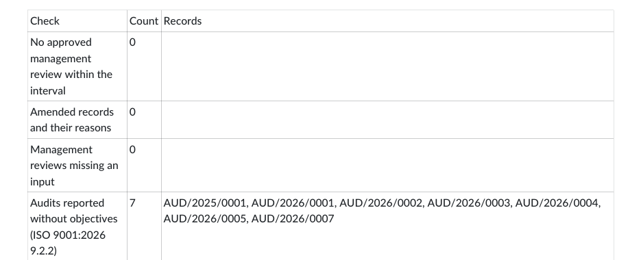
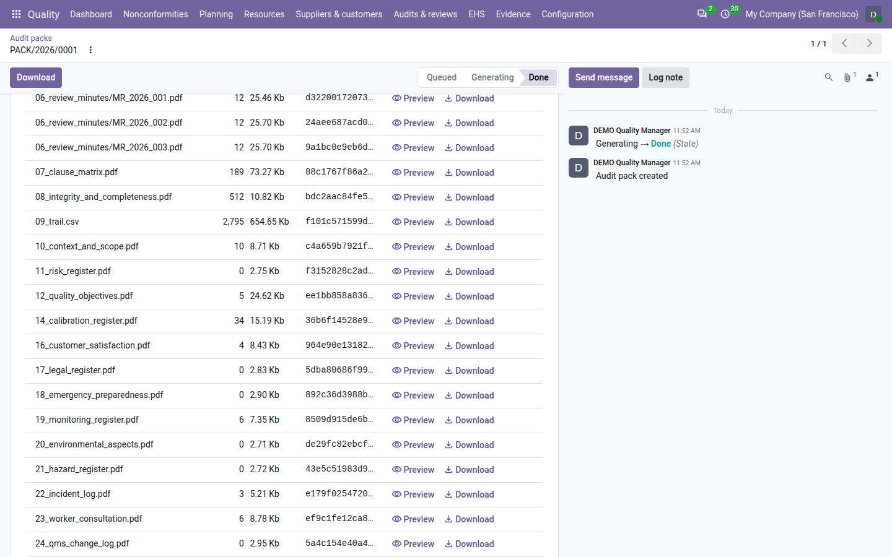

==========
Audit pack
==========

Before a certification or surveillance audit, the external auditor asks for the same evidence every time: the
nonconformity log, the status of the corrective actions, the internal audit reports, the document master list, who
read which procedure, the management review minutes. With **QMS Advanced** installed, the **Quality** app builds all of
it for a period you choose — up to a whole year or more — into **one ZIP file**, the *audit pack*.

Every file in the pack is dated, states its period and how many records it covers, and is fingerprinted with a
SHA-256 hash. The pack also contains its own check: an *integrity and completeness* report that verifies the trail of
every record printed and lists the records an auditor would question. You find the weak records before the auditor
does.

A pack moves through these states:

.. list-table::
   :header-rows: 1
   :widths: 15 85

   * - State
     - Meaning
   * - **Queued**
     - Requested and waiting for its turn. It can still be cancelled.
   * - **Generating**
     - Being built in the background. Its list of files fills as each file is added.
   * - **Done**
     - Finished. The ZIP and each of its files can be downloaded. A done pack is evidence: it is never deleted and
       can no longer change.
   * - **Failed**
     - The generation stopped on an error or ran out of time. The form shows the error and the files built so far.
   * - **Cancelled**
     - Cancelled while it was still queued. Nothing was built.

Request a pack
==============

#. Go to :menuselection:`Quality --> Evidence --> Audit pack --> Request a pack`.
#. Check the :guilabel:`Period start` and :guilabel:`Period end`. By default the period is the last 12 months,
   ending today.
#. Check the :guilabel:`Standards`. By default all enabled standards are chosen. You may also add a disabled standard,
   for example one whose certification is in progress.
#. Tick :guilabel:`Include the trail CSV` if the auditor wants the complete trail of the printed records as a CSV
   file (see `What is inside the ZIP`_). It is off by default.
#. Click :guilabel:`Request`.

.. image:: ../_images/audit-pack-request.png
   :alt: The Request an audit pack dialog with the period start and end, the ISO 9001 standard tag, the Include the
         trail CSV box and the Request button.

Odoo creates the pack in the **Queued** state, numbered *PACK/2026/0002* on the demo data (numbered per company and year), opens its
form and starts the generation in the background. You do not need to wait on the page: come back later from
:menuselection:`Quality --> Evidence --> Audit pack --> Audit packs`.

The period is checked when you click :guilabel:`Request`:

- the end cannot be before the start;
- the period cannot cover the future: it must end today at the latest;
- the period cannot be longer than the :guilabel:`Longest period` setting (24 months by default). A longer period is
  refused with *The period exceeds 24 months: split the pack.* Request two packs instead.

.. note::
   The standards only choose which clauses appear in the clause matrix. Every other file covers all the records of
   the period, whatever their clauses.

.. note::
   The pack covers the company you are working in. Every file is built with the access rights of the person who
   requested the pack: it contains what that person can see, and each PDF says so in its footer (*as visible to*
   followed by their name).

How the pack is generated
=========================

The pack is built in the background by the scheduled action *QMS: audit pack generation*. A request starts it at
once; the scheduled action also runs every 10 minutes on its own.

- **One pack at a time per company.** If a pack of the company is already generating, a new request stays
  **Queued** behind it. Queued packs are generated in the order they were requested; the next one starts at the
  next run of the scheduled action.
- **The form fills while it generates.** Each file appears in the :guilabel:`Files` list as soon as it is written,
  with its record count, size, build time and hash. Reload the form to follow the progress.
- **Time cap.** A pack still generating after the :guilabel:`Time cap` setting (600 seconds by default) fails with
  the error *timeout*. The cap is checked each time a file is finished, and also while the longer files are being
  built — between two parts of the NC log, two audit reports, two review minutes and two batches of the trail CSV or
  of the trail verification — so a single long file cannot run far past it.
- **Interrupted packs.** If the server restarts during a generation, the pack stays in **Generating**. Once the time
  cap has passed, the next run of the scheduled action marks it **Failed** with the error *interrupted* and moves on
  to the next queued pack.
- **Errors.** If a file cannot be built, the pack becomes **Failed** and the error is shown in red on the form. The
  rows of the files built before the error stay in the :guilabel:`Files` list, so you can see how far it went.

.. image:: ../_images/audit-pack-generating.png
   :alt: An audit pack in the Generating state; the Files list shows the first files with their records, size, time
         and SHA-256, and no Preview or Download buttons yet.

.. important::
   A failed pack has no ZIP: the files listed on a failed pack cannot be previewed or downloaded. To get the evidence,
   solve the cause (for example, raise the time cap or shorten the period) and request a new pack. A failed pack is
   never restarted.

Cancel a queued pack
--------------------

While a pack is **Queued**, its requester or a quality manager can click :guilabel:`Cancel` on its form; the button
is shown to them only. The pack moves to **Cancelled**. A pack that is already generating cannot be cancelled: wait for it to finish or fail.

.. tip::
   Because a request starts the generation at once, a pack is usually queued only when another pack of the company is
   generating.

The pack form
=============

Open a pack from :menuselection:`Quality --> Evidence --> Audit pack --> Audit packs`. The list shows each pack's number, period,
requester, request date, duration and state; done packs are green, failed ones red, cancelled ones grey. Use the
:guilabel:`Done` and :guilabel:`Failed` filters, or group by :guilabel:`State`.

The form shows:

.. list-table::
   :header-rows: 1
   :widths: 25 75

   * - Field
     - Meaning
   * - :guilabel:`Period start`, :guilabel:`Period end`
     - The period the pack covers, as requested.
   * - :guilabel:`Standards`
     - The standards whose clauses appear in the clause matrix.
   * - :guilabel:`Include the trail CSV`
     - Whether the trail CSV file was asked for.
   * - :guilabel:`Requested by`, :guilabel:`Requested on`
     - Who requested the pack, and when. Every file is built with this person's access rights.
   * - :guilabel:`Started on`, :guilabel:`Finished on`
     - When the generation started and ended.
   * - :guilabel:`Duration (s)`
     - How many seconds the generation took.
   * - :guilabel:`Bundle hash`
     - Shown once the pack is done: one SHA-256 fingerprint that covers every file of the pack (see
       `Verify the pack`_).

The chatter below keeps every change of state. A pack is itself a controlled record: its state, period and standards
are recorded in its trail (see :doc:`trail`), and it is locked once done.

.. image:: ../_images/audit-pack-done.png
   :alt: A done audit pack: the Download button in the header, the period, standards, requested by and on, started and
         finished on, duration and bundle hash, and the Files list with Preview and Download on each row.

The files list
--------------

Under :guilabel:`Files`, the form lists one row per file of the pack, in the order of the ZIP:

.. list-table::
   :header-rows: 1
   :widths: 20 80

   * - Column
     - Meaning
   * - :guilabel:`File`
     - The file's name, with its folder, for example ``03_audit_reports/AUD_2026_0001.pdf``.
   * - :guilabel:`Records`
     - How many records the file covers (see the table in `What is inside the ZIP`_).
   * - :guilabel:`Size`
     - The file's size.
   * - :guilabel:`Time (s)`
     - How long the file took to build.
   * - :guilabel:`SHA-256`
     - The file's fingerprint. It is the same value as in ``manifest.json`` and ``README.txt``.

Once the pack is **Done**, each row has two buttons:

- :guilabel:`Preview` opens the file in a new browser tab, to read it before downloading: a PDF opens in the
  browser's PDF viewer, a CSV file shows as plain text.
- :guilabel:`Download` saves that one file on its own, without the rest of the pack.

Both read the file out of the pack's ZIP and check it first: a file that no longer matches its SHA-256 is refused with
*… no longer matches its SHA-256: the bundle was altered, so it is not served.* Odoo never serves an altered file.

.. note::
   Packs made with an earlier version of the app show their files too, rebuilt from their manifest; their
   :guilabel:`Time (s)` shows 0.0 because the build time was not recorded then.

Download the whole pack
-----------------------

On a done pack, click :guilabel:`Download` in the header. The browser saves the ZIP, named after the pack number, for
example ``PACK_2026_0001.zip``. Hand this file to the auditor, together with the bundle hash.

.. tip::
   The :guilabel:`Print` menu of the pack form also offers the pack's own reports one by one (:guilabel:`NC log`,
   :guilabel:`CAPA status`, :guilabel:`Audit programme`, :guilabel:`Acknowledgement matrix`, :guilabel:`Integrity
   and completeness`, :guilabel:`Clause matrix`). They are printed again from today's data and with your own access
   rights, so they are not the files of the pack: for evidence, use the files of the pack.

What is inside the ZIP
======================

The files come in a fixed order, so that every pack looks the same to an auditor: files 01 to 06, then the registers
10 to 16, then the environment, health and safety registers 17 to 23, then the change log 24, then 07, 08 and 09.
A section with nothing in the period still gets its PDF, stating *0 records in period*: absence is evidence too.
Files 13 and 15 are present
only when their add-on is installed. Files 17 to 23 are present only when the pack's :guilabel:`Standards` include
ISO 14001 or ISO 45001 **and** the registers of that standard are switched on (see :doc:`ehs_setup`): files 20
(aspects) with ISO 14001, files 21 (hazards) and 23 (worker consultation) with ISO 45001, the others with either.

.. list-table::
   :header-rows: 1
   :widths: 30 50 20

   * - File
     - What it shows
     - Records counted
   * - ``01_nc_log.pdf``
     - Every nonconformity detected in the period: number, detection date, source, severity, process, owner, state,
       closing date and who closed it. Cancelled nonconformities are listed apart, under *Cancelled*, with their
       reason. Above the :guilabel:`NC log rows per file` setting (5,000 by default), the log is split into
       ``01_nc_log_part1.pdf``, ``01_nc_log_part2.pdf`` and so on.
     - Nonconformities in the file
   * - ``02_capa_status.pdf``
     - The corrective and preventive actions due in the period — number, kind, origin, owner, due date, state and
       verdict — headed by the figures of the period: nonconformities closed, how many of them with a verified
       corrective action, the effectiveness ratio, the actions overdue at the end of the period, and the recurrences
       detected. See :doc:`corrective_actions`.
     - Actions due in the period
   * - ``03_audit_programme.pdf``
     - The audit programmes of the years the period touches, with their completion and their audits (process, lead
       auditor, planned month, state). An audit still in progress is shown as *Planned*. See :doc:`audits`.
     - Programmes
   * - ``03_audit_reports/``
     - One PDF per internal audit **reported or closed** with its end date in the period, named after the audit, for
       example ``AUD_2026_0001.pdf``: the signed audit report with its objectives, checklist, findings and conclusion
       (*Objectives: —* when the audit has none). Audits still in progress are not included: they are not evidence
       yet.
     - Checklist lines of the audit
   * - ``04_document_master_list.pdf``
     - The document master list as at the last day of the period: for each document, its code, title, type, owner,
       the version in force on that day, its effective date, next review, audience, acknowledgements and clauses. See
       :doc:`documents`.
     - Documents
   * - ``05_acknowledgement_matrix.pdf``
     - A table of people against the document versions in force at some time during the period. Each cell shows the
       date the person acknowledged the version with the time they first opened it (*opened not recorded* for
       acknowledgements given before openings were recorded), *opened …, not yet acknowledged*, *pending* when they
       have not opened it yet, or *not required* when the version was not addressed to them. The acknowledgement matrix shows who confirmed they read and understood each
       controlled document, and when. It is evidence of awareness (ISO 9001 7.3). It is not a training or competence
       record (7.2): competence is recorded by the Training & Competence add-on.
     - Cells of the table
   * - ``06_review_minutes/``
     - One PDF per management review **approved** with its meeting in the period, named after the review, for example
       ``MR_2026_001.pdf``: the minutes with inputs, decisions and conclusion. See :doc:`management_reviews`.
     - Inputs of the review
   * - ``10_context_and_scope.pdf``
     - The context issues active and the interested parties with their needs at the end of the period, and the scope
       in force then with its clauses not applicable. See :doc:`context`.
     - Issues, parties and scope versions
   * - ``11_risk_register.pdf``
     - Every risk and opportunity open at any time in the period, with its assessments up to the end of the period, its
       treatment and its actions. See :doc:`risks`.
     - Risks
   * - ``12_quality_objectives.pdf``
     - The objectives whose period overlaps the pack period, as of its end: target, actual, status, plan and
       measurements. See :doc:`objectives`.
     - Objectives
   * - ``13_competence_and_training.pdf``
     - Only with the Training & Competence add-on. The competence matrix at the end of the period and the trainings of
       the period with each attendee's result and effectiveness verdict, headed *Competence (ISO 9001 7.2)*. See
       :doc:`competence`.
     - Matrix cells and trainings
   * - ``14_calibration_register.pdf``
     - The calibration register as at the end of the period: every instrument with its status and the calibrations of
       the period. See :doc:`calibration`.
     - Instruments
   * - ``15_approved_supplier_list.pdf``
     - Only with the supplier evaluation add-on. The approved supplier list at the end of the period: every supplier
       with its status, decision, signer and conditions. See :doc:`suppliers`.
     - Suppliers
   * - ``16_customer_satisfaction.pdf``
     - The confirmed satisfaction records whose period overlaps the pack period, with the complaint trend. See
       :doc:`satisfaction`.
     - Satisfaction records
   * - ``17_legal_register.pdf``
     - The legal register as at the end of the period for the pack's standards: every obligation with its latest
       result and permit status, and the compliance evaluations of the period. See :doc:`legal_requirements`.
     - Obligations and evaluations
   * - ``18_emergency_preparedness.pdf``
     - The emergency situations with their plan and drill status, and the drills of the period with their outcome. See
       :doc:`emergency_preparedness`.
     - Situations and drills
   * - ``19_monitoring_register.pdf``
     - The monitoring indicators with their limits and reading status, and the readings of the period with their
       classification. See :doc:`monitoring`.
     - Indicators and readings
   * - ``20_environmental_aspects.pdf``
     - Only with ISO 14001. The aspects open in the period with their score, significance and basis, controls and
       assessments up to the end of the period. See :doc:`environmental_aspects`.
     - Aspects
   * - ``21_hazard_register.pdf``
     - Only with ISO 45001. The hazards open in the period with their scores before and after, further controls by
       hierarchy level and PPE justification. See :doc:`hazards`.
     - Hazards
   * - ``22_incident_log.pdf``
     - The incidents that occurred in the period, of the types of the pack's standards, with their type, date,
       reportability and nonconformity state, and the totals by type and treatment. It prints no person name and no
       injury detail. See :doc:`incidents`.
     - Incidents
   * - ``23_worker_consultation.pdf``
     - Only with ISO 45001. The consultations held and the worker hazard reports submitted in the period, with their
       outcomes. A confidential reporter is never named, not even for a quality manager. See
       :doc:`worker_consultation`.
     - Consultations and reports
   * - ``24_qms_change_log.pdf``
     - The QMS change log of the period: every change approved, implemented, closed or cancelled, with its
       authorisation, dates, actions arising, review of results and verdict, then the changes still awaiting their
       review. In every pack, whatever its standards and the ISO 9001 edition. See :doc:`change_register`.
     - Changes
   * - ``07_clause_matrix.pdf``
     - For each chosen standard, every clause with its number, title, evidence count in the period and the count per
       type of record. Clauses without evidence are highlighted and marked *no evidence*. See `The clause matrix`_.
     - Clauses
   * - ``08_integrity_and_completeness.pdf``
     - The trail verification of every record printed, and the completeness checks. See
       `The integrity and completeness report`_.
     - Records verified
   * - ``09_trail.csv``
     - Only when :guilabel:`Include the trail CSV` was ticked. Every trail row of the records the pack prints —
       nonconformities, actions, audits, findings, document versions, reviews and the records of files 10 to 23 — with
       the columns ``model``, ``record``, ``sequence``,
       ``timestamp``, ``user``, ``event``, ``field``, ``old``, ``new``, ``reason``, ``prev_hash`` and ``hash``. The
       auditor can recompute the hash chain with their own tools. See :doc:`trail`.
     - Trail rows
   * - ``manifest.json``
     - A machine-readable summary: the pack number, the period, the standards, when it was generated (UTC), who
       requested it, the app version, and for every file above its name, size in bytes, SHA-256 and record count.
     - —
   * - ``README.txt``
     - How to verify the files, the pack number and period, the SHA-256 of ``manifest.json``, then one line per file
       with its SHA-256.
     - —

States, severities, source types, kinds and verdicts are printed as you read them in Odoo, for example *In progress*
or *Complaint*, never as internal codes.

Every PDF ends with the standard footer of the app: when it was generated (UTC and local time), its period, how many
rows it contains and for whom (*as visible to* followed by the requester's name), and its *document hash*. The
document hash is a fingerprint of the body of the document; it ties a printed copy to the document that was
generated. See :doc:`trail`.

.. image:: ../_images/audit-pack-zip.png
   :alt: The content of an audit pack ZIP opened in a file manager: files 01 to 23, the 03_audit_reports and
         06_review_minutes folders, manifest.json and README.txt.

.. note::
   Requesting the same period twice gives two packs with different hashes, because the generation time printed in
   each file differs. Both packs are kept.

Verify the pack
===============

An auditor can check that the files they hold are exactly the files Odoo produced, with standard tools and without
access to Odoo.

**Check each file.** On Linux or macOS, run ``sha256sum`` on a file (on Windows, ``certutil -hashfile <file>
SHA256``) and compare the result with the line of that file in ``README.txt`` or in ``manifest.json``. From the folder
where the ZIP was extracted, this checks every file at once:

.. code-block:: console

   $ tail -n +5 README.txt | awk '{print $2"  "$1}' | sha256sum --check

**Check the manifest.** ``README.txt`` gives the SHA-256 of ``manifest.json`` on its fourth line. Compare it with
``sha256sum manifest.json``.

**Check the bundle hash.** The :guilabel:`Bundle hash` on the pack form is one fingerprint for the whole pack: the
SHA-256 of the SHA-256 values of all the files listed in the manifest, sorted and written one after the other without
separators. It can be recomputed from ``README.txt``:

.. code-block:: console

   $ tail -n +5 README.txt | awk '{print $2}' | LC_ALL=C sort | tr -d '\n' | sha256sum

The result must equal the :guilabel:`Bundle hash` shown on the pack. Give the auditor the bundle hash separately from
the ZIP — for example in the covering email or on the audit plan — so that they can check that the pack they received
is the one you generated.

.. important::
   The bundle hash is **not** the SHA-256 of the ZIP file itself, and it is not written in ``README.txt``: running
   ``sha256sum`` on the ZIP gives a different value. Take the bundle hash from the pack form.

The integrity and completeness report
=====================================

``08_integrity_and_completeness.pdf`` has two parts.

Trail integrity
---------------

For every type of record the pack covers — nonconformities, actions, audits, findings, document versions, reviews,
the records of files 10 to 16, and the pack itself — the report verifies the trail of each record, exactly as :guilabel:`Verify trail` does on a
record (see :doc:`trail`), and prints a table:

- :guilabel:`Records verified`: how many records were checked;
- :guilabel:`Intact`: how many have an unbroken trail;
- :guilabel:`Broken`: each broken record by name, as *BROKEN* followed by the record and, in brackets, *row* with
  the number of the first trail row that does not match — the same row number that :guilabel:`Verify trail` shows
  on the record, so you can find it on the record's :guilabel:`Trail` tab.

For document versions, the report also checks that the stored file still matches the fingerprint recorded when the
version was approved. A file that changed is listed as *(file changed)*. A record is counted once, whatever the
number of problems it has.

A broken trail does not stop the pack: it is reported, which is the point. Verifying changes nothing.

.. important::
   A broken record means the database was changed outside Odoo. Do not try to correct it: keep the pack as it is and
   inform your quality manager and your system administrator.

Completeness checks
-------------------

The second part lists the records an external auditor would question. For each check it prints the count and the
names of the records concerned (the first 50). The checks only read: they never change a record. A check whose part of
the app is not installed shows *n/a*.

.. list-table::
   :header-rows: 1
   :widths: 35 65

   * - Check
     - What it lists
   * - Closed nonconformities with an empty containment, correction or root cause
     - Nonconformities closed during the period with one of these three treatment fields empty.
   * - Cancelled nonconformities and their reasons
     - Every nonconformity detected in the period and cancelled, with the cancellation reason.
   * - Nonconformities without product, process or cause category
     - Nonconformities detected in the period that have none of the three: no product, no process and no cause
       category.
   * - Printed records without a clause tag
     - Any record the pack covers (nonconformity, action, audit, finding, document version, review) that carries no
       clause.
   * - Actions whose owner changed within 24 hours before the verdict
     - Actions verified during the period whose owner was changed in the 24 hours before the effectiveness verdict.
   * - Verified actions without an evidence reference
     - Actions verified during the period with an empty :guilabel:`Evidence` field.
   * - Closed major or critical nonconformities without a verified corrective action
     - Major and critical nonconformities closed during the period that have no verified corrective action.
   * - Audits whose process membership changed within 90 days before the start
     - Audits starting in the period whose process owner or auditees changed in the 90 days before the audit's start
       date, up to the moment the audit was started. A change made after the start does not count.
   * - Documents in force whose acknowledgements are overdue
     - Documents whose version in force still has acknowledgements pending past their due date, on the day the pack
       is generated.
   * - No approved management review within the interval
     - Shown when no management review has its meeting date within the :guilabel:`Review interval` (12 months by
       default) before the end of the period **and** was approved (signed) within that interval: a review approved
       after the end of the period does not count for it. It lists nothing when the review interval is set to ``0``.
       See :doc:`management_reviews`.
   * - Amended records and their reasons
     - Every record the pack covers that was amended after locking, with the reasons given (see :doc:`trail`).
   * - Management reviews missing an input
     - Approved reviews of the period whose agenda lacks an ISO 9001 input that existed when the review was created, or
       holds an input neither discussed nor noted. Each review is judged against the agenda of its own edition: a
       review created under 2015 is never asked for the 2026 inputs. See :doc:`management_reviews`.
   * - Audits reported without objectives (ISO 9001:2026 9.2.2)
     - Only when ISO 9001 follows the 2026 edition: the audits reported or closed in the period with no objectives.
       See :ref:`audits-objectives`.
   * - Approved scope without a climate change decision
     - With file 10 only, under either edition: the scope in force at the end of the period when it was approved
       without a climate change decision. See :ref:`context-climate`.
   * - Open significant environmental aspects without any control
     - With file 20 only. See :doc:`environmental_aspects`.
   * - Open high or critical hazards waiting for a further control, or critical with PPE only and no justification
     - With file 21 only. See :doc:`hazards`.
   * - Reportable incidents not reported to the authority by their due date
     - With file 22 only. See :doc:`incidents`.
   * - Active legal requirements whose compliance evaluation is overdue
     - With file 17 only. See :doc:`legal_requirements`.
   * - Active monitoring indicators with overdue readings
     - With file 19 only. See :doc:`monitoring`.

The checks marked *With file … only* are left out of the report when their file is not part of the pack.

.. image:: ../_images/audit-pack-integrity.png
   :alt: The integrity and completeness PDF: the trail integrity table per type of record with verified, intact and
         broken counts, followed by the completeness checks with their counts and record names.

.. tip::
   Request a pack a few weeks before the external audit and read this report first. Each record it lists is a question
   the auditor may ask: complete the record, amend it with a reason, or prepare the explanation.

.. _audit-pack-2026:

Under the 2026 edition
----------------------

When ISO 9001 follows the 2026 edition (see :doc:`edition_switch`), the completeness checks also list the audits
reported or closed in the period without objectives, for example the audits started before the switch. The clause
matrix shows the 2026 titles and sub-clauses.

         a count of 7 and the audit numbers.

The change log, ``24_qms_change_log.pdf``, is in every pack, under either edition:

         count, size, SHA-256 and the Preview and Download links.

The clause matrix
=================

The clause matrix shows, for each clause of the chosen standards, how much evidence the period holds: the clause
number, its title, the evidence count and the count per type of record (nonconformities, actions, audits and so on).
A parent clause also counts the evidence of its sub-clauses. Clauses with no evidence are highlighted and marked
*no evidence*. It is the :doc:`clause view <clauses>` on paper, counted the same way, with the same sentence: records
tagged to a clause show where to look; they are not proof of conformity.

The pack always contains it as ``07_clause_matrix.pdf``. To print it on its own, without building a pack:

#. Go to :menuselection:`Quality --> Evidence --> Audit pack --> Clause matrix`.
#. Choose the :guilabel:`Period start`, the :guilabel:`Period end` (the last 12 months by default) and the
   :guilabel:`Standards` (all enabled standards by default).
#. Click :guilabel:`Print`. Odoo downloads the PDF.

.. image:: ../_images/audit-pack-clause-matrix.png
   :alt: The clause matrix PDF for ISO 9001: clause number, title, evidence count and counts by record type, with
         clauses without evidence highlighted.

Retention
=========

- A **done** pack is never deleted, by anyone. Its ZIP cannot be changed, moved or deleted either.
- A **queued** or **generating** pack cannot be deleted.
- A **failed** or **cancelled** pack can be deleted by a quality manager: select it in the list and click
  :guilabel:`Actions` ‣ :guilabel:`Delete`, or use :guilabel:`Delete` in the gear menu of its form.

Settings
========

Go to the :menuselection:`Settings` app and open the :guilabel:`Quality` section. Only quality managers see it. The
:guilabel:`Audit pack` block holds three settings:

.. list-table::
   :header-rows: 1
   :widths: 25 12 63

   * - Setting
     - Default
     - What it does
   * - :guilabel:`Longest period`
     - 24
     - The longest period one pack may cover, in months, from 1 to 60. Longer periods must be split into several
       packs. Example: set 12 to have one pack per audit year.
   * - :guilabel:`Time cap`
     - 600
     - Seconds after which a generating pack fails with *timeout*; at least 60. It also decides when a pack left
       generating by a server restart is marked *interrupted*. Example: raise it to 1800 if a large pack fails with
       *timeout*.
   * - :guilabel:`NC log rows per file`
     - 5000
     - Above this many nonconformities, the NC log is split into several PDF files; at least 500. Example: with 5,000
       and 12,000 nonconformities in the period, the pack holds three parts: 5,000, 5,000 and 2,000.

A value outside these limits is refused when you click :guilabel:`Save`, and nothing is saved.

.. image:: ../_images/audit-pack-settings.png
   :alt: The Audit pack block of the Quality settings: longest period 24, time cap 600 and NC log rows per file 5000.

The :guilabel:`Review interval` of the :guilabel:`Management review` block is also used, by the completeness check on
management reviews.

Who can do what
===============

.. list-table::
   :header-rows: 1
   :widths: 25 75

   * - Role
     - Audit packs
   * - **User**
     - No access: the :menuselection:`Evidence --> Audit pack` menu is not shown and packs cannot be opened or downloaded.
   * - **Internal auditor**
     - Sees every pack of their companies and downloads them and their files. Requests packs and prints the clause
       matrix. Cancels the packs they requested while they are queued.
   * - **Manager**
     - Everything an internal auditor can do, cancels any queued pack, deletes failed and cancelled packs, and changes
       the settings.

A pack's ZIP and files follow the pack's access: someone who cannot open the pack cannot download them, even with the
link.

See :doc:`roles` for the full picture.

.. seealso::
   - :doc:`trail`
   - :doc:`clauses`
   - :doc:`nonconformities`
   - :doc:`corrective_actions`
   - :doc:`audits`
   - :doc:`documents`
   - :doc:`management_reviews`
