===============
Change register
===============

Auditors ask *show me how you planned your last change to the system*, and *who authorised this change on the line?*
With **QMS Advanced** installed, the **Quality** app keeps one record per change, from the idea to the judged result:
why it is made, what could go wrong, how the quality system stays whole while it changes, who authorises it, when it
was made and communicated, the actions it caused and whether it achieved its purpose.

One register holds two kinds of change:

.. list-table::
   :header-rows: 1
   :widths: 30 15 55

   * - Kind
     - Clause
     - Examples
   * - :guilabel:`QMS change (6.3)`
     - ISO 9001 6.3
     - A change to the quality management system itself: a new process, merged teams, a new ERP, a reorganised
       document system.
   * - :guilabel:`Production or service change (8.5.6)`
     - ISO 9001 8.5.6
     - A change to how products are made or services delivered: a second source for a critical part, a machine
       setting, a modified inspection step, a new shift pattern.

The kind tags the change to its clause, so the clause view answers *show me your 6.3 evidence* without anyone tagging
by hand. Both clauses exist in the 2015 and the 2026 edition of ISO 9001: the register works the same under both (see
:doc:`edition_switch`).

The register is under :menuselection:`Quality --> Planning --> Changes`, next to the risks and objectives.

.. list-table::
   :header-rows: 1
   :widths: 18 82

   * - State
     - Meaning
   * - **Draft**
     - Being planned. It can be saved with a title only and completed later.
   * - **Approved**
     - Authorised with a signature, not yet made.
   * - **Implemented**
     - Made and communicated, waiting for the review of its results. An urgent change made before anyone could
       approve it is **Implemented** with a *To authorise* ribbon until it is approved.
   * - **Closed**
     - Judged with a signed verdict. It is locked.
   * - **Cancelled**
     - Stopped before it was made, with the reason. It is locked.

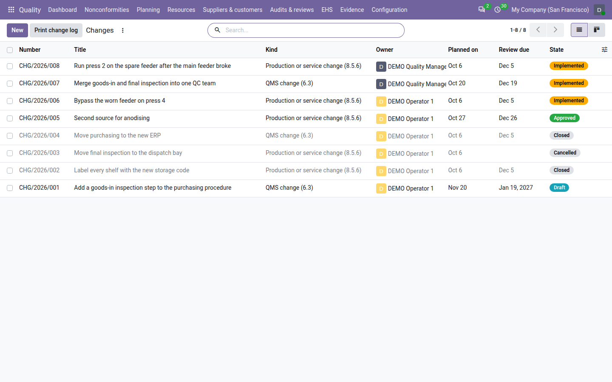
         closed and cancelled changes are greyed.

The list also has a kanban view by state. Use the filters :guilabel:`QMS changes`, :guilabel:`Production or service
changes`, :guilabel:`Awaiting effectiveness review`, :guilabel:`Review overdue`, :guilabel:`Authorisation pending`,
:guilabel:`Draft` and :guilabel:`Mine` (the changes you own, approve or review), or group by :guilabel:`Kind`,
:guilabel:`State`, :guilabel:`Owner` or :guilabel:`Planned date`.

.. note::
   A routine revision of a procedure does not need a change record: document control already handles it (see
   :doc:`documents`). Record a change when the system or the way you produce changes, and link the documents it
   needs revised.

Three people, three steps
=========================

.. list-table::
   :header-rows: 1
   :widths: 18 82

   * - Role
     - What they do
   * - **Owner**
     - Plans the change, marks it implemented and raises the actions that arise from it. You by default.
   * - **Approver**
     - Authorises the change before it is made. Any quality manager can approve too. An owner who is not a quality
       manager cannot approve their own change.
   * - **Reviewer**
     - Judges the results after the change and records the verdict. Never the owner, so that nobody judges their own
       change.

When the buttons of a step are hidden for you, a blue line at the top of the form says who can act, for example
*Planned by DEMO Operator 1; DEMO Quality Manager approves it.* or *Waiting for the effectiveness review by DEMO
Operations Manager.*

Plan a change
=============

#. Go to :menuselection:`Quality --> Planning --> Changes` and click :guilabel:`New`.
#. Write the title in one line, for example *Merge goods-in and final inspection into one QC team*.
#. Choose the :guilabel:`Kind`. :guilabel:`Clauses` shows *9001 · 6.3 Planning of changes* for a QMS change, or
   *9001 · 8.5.6 Control of changes* for a production or service change.
#. Choose the :guilabel:`Trigger`: what made you decide on the change — :guilabel:`Management review output`,
   :guilabel:`Nonconformity`, :guilabel:`Risk or opportunity`, :guilabel:`Interested party need`,
   :guilabel:`Legal or other requirement`, :guilabel:`Improvement` (the default) or :guilabel:`Other`.
#. Check the :guilabel:`Owner`.
#. Save. The change gets its number, for example *CHG/2026/007*, and is a **Draft**.

A blue line at the top lists what Approve still needs, with the minimum length of each text:

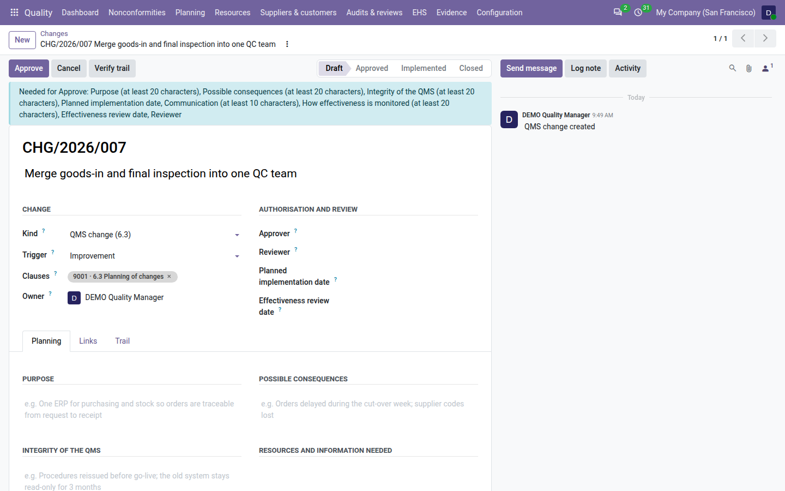
         Integrity of the QMS, Planned implementation date, Communication, How effectiveness is monitored,
         Effectiveness review date and Reviewer.

Then complete the plan:

#. On the :guilabel:`Planning` tab, write:

   - :guilabel:`Purpose`: why the change is made (at least 20 characters);
   - :guilabel:`Possible consequences`: what could go wrong (at least 20 characters);
   - :guilabel:`Integrity of the QMS`: how the quality system stays whole during and after the change, for example
     which documents are reissued before the change (at least 20 characters);
   - :guilabel:`Resources and information needed` (optional);
   - :guilabel:`Communication`: to whom and how the change is told (at least 10 characters);
   - :guilabel:`How effectiveness is monitored`: how you will know the change achieved its purpose (at least 20
     characters).

#. Under :guilabel:`Authorisation and review`, choose the :guilabel:`Reviewer` and, if you want a named approver, the
   :guilabel:`Approver`. Only users who may take that role are offered.
#. Set the :guilabel:`Planned implementation date`. The :guilabel:`Effectiveness review date` is proposed 60 days
   later (the :ref:`Effectiveness review <change-register-settings>` setting); change it if needed. It cannot be
   before the planned date.
#. Save. The *Needed for Approve* line disappears when everything is there.

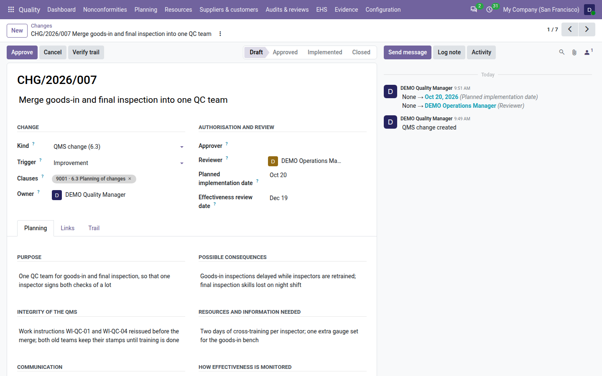
         date, and the Planning tab with the purpose, consequences, integrity, resources, communication and
         effectiveness criteria filled in.

When the trigger is :guilabel:`Management review output` or :guilabel:`Nonconformity`, Approve also needs the source:
see `Link what the change touches`_.

Link what the change touches
----------------------------

On the :guilabel:`Links` tab:

- :guilabel:`Processes`, :guilabel:`Documents to create or revise` and :guilabel:`Risks and opportunities affected`:
  the records of your company that the change touches;
- :guilabel:`Source management review` and :guilabel:`Source nonconformity`: where the change comes from;
- :guilabel:`Follows up`: an earlier change that this one corrects or completes. The earlier change must be approved
  at least.

The links can change until the change is closed; after approval, each change of a link is kept in the trail. Each
linked process, document and risk shows a :guilabel:`Changes` button with the number of changes that touch it.

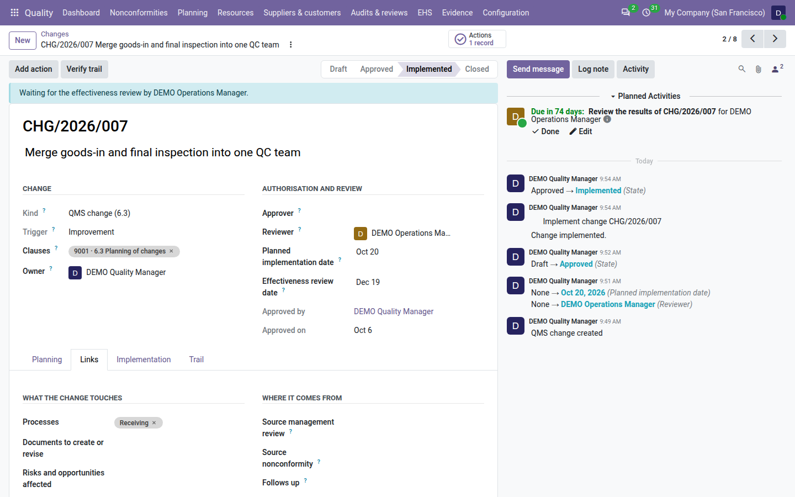
         and Follows up fields.

Approve the change
==================

When an approver is named, the owner can click :guilabel:`Ask for approval`: the approver gets a to-do *Approve change
CHG/2026/007*, due in 7 days. Pressing it again does not add a second to-do.

To approve, the approver or a quality manager:

#. Opens the change and clicks :guilabel:`Approve`.
#. Enters their own password when Odoo asks for it (the *Access Control* dialog), then clicks :guilabel:`Confirm
   Password`.

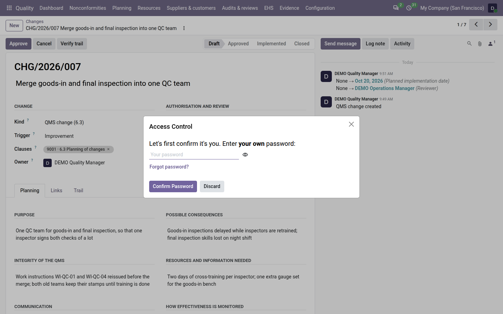

The approval is an electronic signature with the reason *Change authorisation*. The change moves to **Approved**,
with :guilabel:`Approved by` and :guilabel:`Approved on`. The owner gets a to-do *Implement change CHG/2026/007*, due
on the planned implementation date.

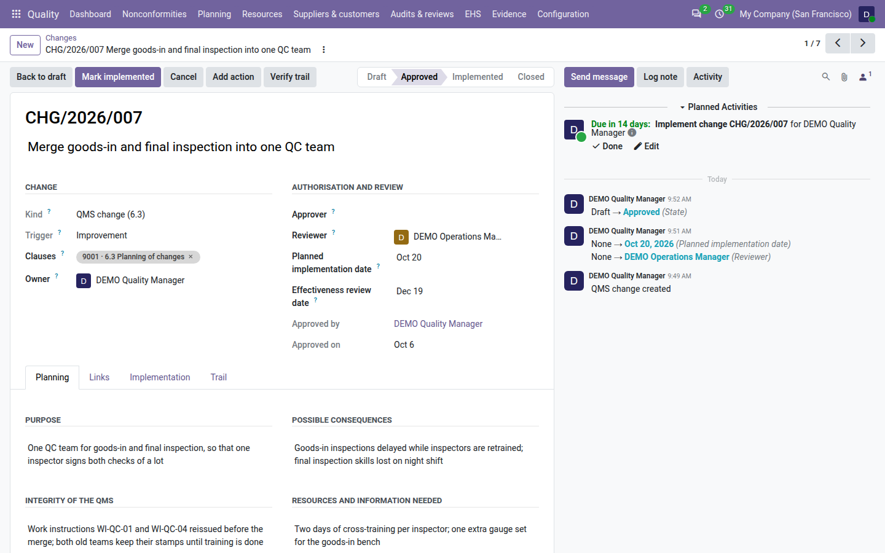
         Cancel and Add action buttons, and the Implement change to-do in the chatter.

Odoo refuses to approve:

- with planning items missing, listed all at once: *Approve needs these first:* followed by one line per item, the same
  items as the *Needed for Approve* line;
- by an owner who is not a quality manager: *You own this change: a quality manager or another approver authorises
  it. Name the approver and press Ask for approval.*
- by the user who created the change: *You created this change, so you cannot authorise it: ask the owner to name
  another approver, or a quality manager approves.*

Once approved, the :guilabel:`Kind` and the :guilabel:`Trigger` are fixed: *The kind is fixed once the change is
approved; cancel it and record a new one if it was wrong.*

Back to draft
-------------

While an approved change is not yet made, the owner, the approver or a quality manager can click :guilabel:`Back to
draft`, for example to change the plan. The approval is cleared and a new approval is needed; the signature stays in
the trail.

Mark the change implemented
===========================

When the change has been made and the people affected were told:

#. Open the change and click :guilabel:`Mark implemented`.
#. Check :guilabel:`Implemented on`: today by default, never after today and never before the approval.
#. Enter :guilabel:`Communicated on`: the day the people affected were told, between the approval and today. It may be
   before the implementation day.
#. Optionally, write :guilabel:`What was communicated`.
#. Click :guilabel:`Confirm`.

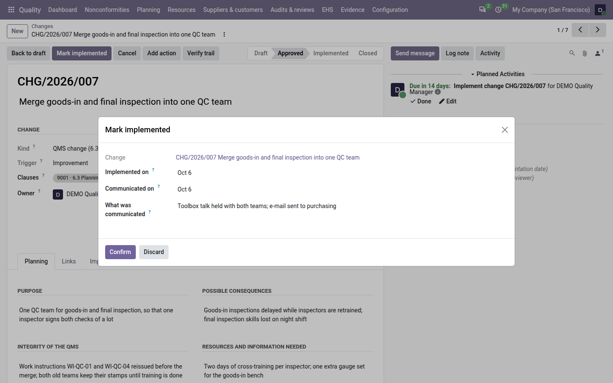

Odoo confirms *Change CHG/2026/007 implemented on 10/06/2026. Effectiveness review due on 12/19/2026.* The change
moves to **Implemented**, the dates are on the :guilabel:`Implementation` tab, and the reviewer gets a to-do *Review
the results of CHG/2026/007*, due on the effectiveness review date.

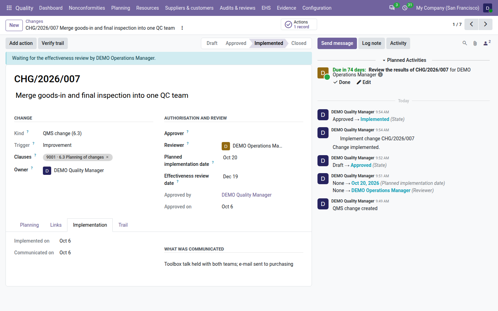
         Actions button and the Implementation tab with the dates and what was communicated.

Odoo refuses dates that do not fit:

- *The change was made before it was approved: use Record urgent change for an operational change that could not
  wait, or correct the date.*
- *The change cannot have been made after today: enter the day it was made.*
- *The change cannot be communicated before it was approved (…) or after today: correct the communication date.*

Add the actions that arise
==========================

Work that the change needs — retrain operators, update a control plan, requalify a supplier — is tracked as an action,
with an owner, a due date and its own verdict.

#. On an approved or implemented change, click :guilabel:`Add action`.
#. Odoo opens a new action with :guilabel:`Change` set to the change, kind :guilabel:`Preventive`, the change's clauses,
   the change's owner, the change's reviewer as :guilabel:`Verifier`, and the planned implementation date as due date
   (today once the change is implemented).
#. Write the title and the description, then save. The empty description suggests what to write: *What work the change
   needs, e.g. retrain operators or update the control plan*.

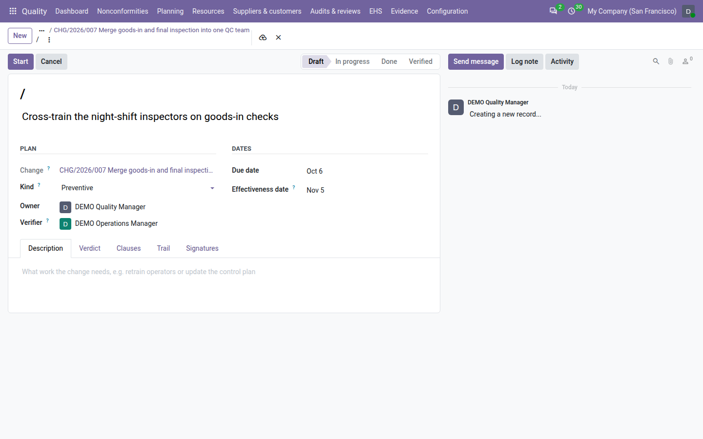
         and the empty description showing its hint.

The action is followed like any other in :menuselection:`Quality --> Nonconformities --> Corrective actions` (see
:doc:`corrective_actions`). The change shows an :guilabel:`Actions` button and lists them on its :guilabel:`Links`
tab. An action arising from a change is always preventive: a change that went wrong is a nonconformity.

Open actions do not stop you marking the change implemented, but the verdict waits until they are done or cancelled.

Record an urgent change
=======================

A line stops at night and the shift leader swaps a part or a machine setting to keep running. Nobody could approve it
beforehand, yet the change must still be authorised and reviewed. Only a **production or service change** can be
recorded this way: a change to the quality system itself can always wait for approval.

#. Create the change with the kind :guilabel:`Production or service change (8.5.6)` and fill in its planning items as
   above. The planned date is not needed: it becomes the day the change was made.
#. Click :guilabel:`Record urgent change`.
#. Write :guilabel:`Why it could not wait` (at least 20 characters), check :guilabel:`Implemented on`, enter
   :guilabel:`Communicated on` and, optionally, :guilabel:`What was communicated`.
#. Click :guilabel:`Confirm`.

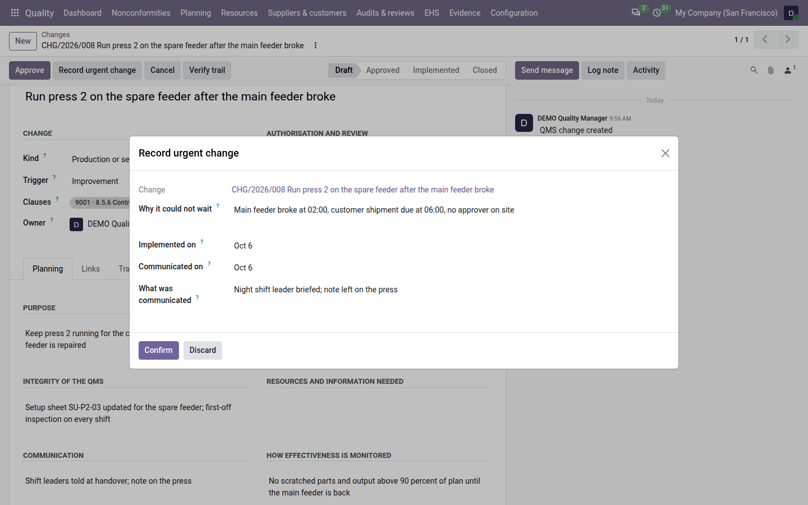
         and what was communicated.

Odoo confirms *Urgent change CHG/2026/008 recorded as made on 10/06/2026. Authorisation pending: a quality manager
presses Approve.* The change is **Implemented** with a *To authorise* ribbon. The approver, or every quality manager
when no approver is named, gets a to-do *Approve change CHG/2026/008*, due in 7 days. The first approval closes the
other quality managers' to-dos.

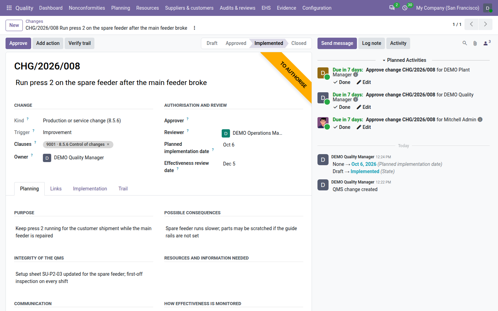
         change to-dos for the quality managers.

To authorise it afterwards, the approver or a quality manager clicks :guilabel:`Approve` and confirms their password,
as for any approval. The change stays **Implemented**, now with :guilabel:`Approved by` and :guilabel:`Approved on`,
and the reviewer gets the review to-do. The verdict is refused until then: *Authorise the change first: <approver>
presses Approve.*

.. tip::
   An approver who does not agree with an urgent change still authorises the record, then judges it *Not effective*
   with a follow-up change that reverses it. The change log prints the urgent flag and the reason for every urgent
   change, so a habit of skipping approval is visible to the auditor.

Record the verdict
==================

When the effectiveness review is due, the reviewer — or a quality manager who is not the owner — judges the change
against the criteria set at approval.

#. Open the implemented change and click :guilabel:`Record verdict`.
#. Read :guilabel:`Criteria set at approval`.
#. Write :guilabel:`Results of the review`: what was found against the criteria (at least 20 characters).
#. Choose the :guilabel:`Verdict`: :guilabel:`Effective`, :guilabel:`Partially effective` or :guilabel:`Not effective`.
#. Click :guilabel:`Sign the verdict and close`, and enter your password when Odoo asks for it.

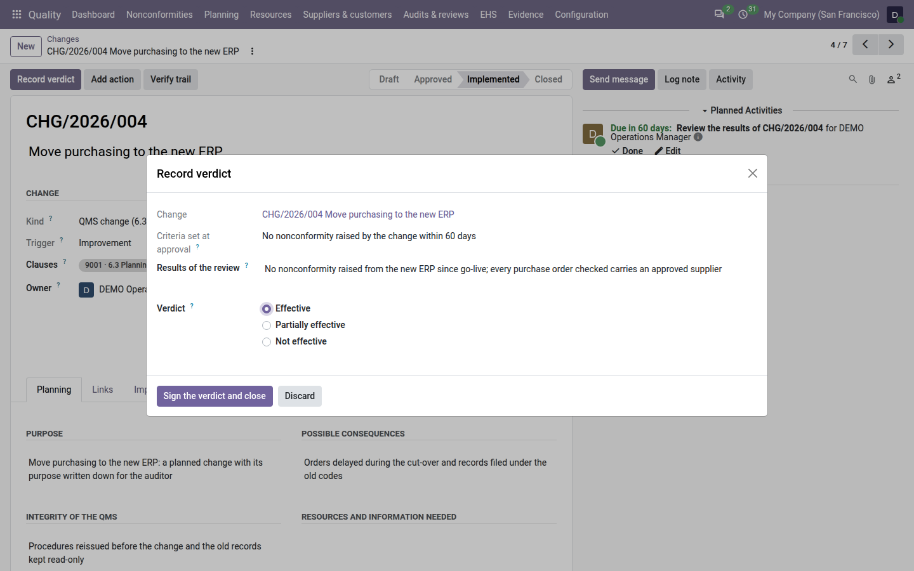
         the Effective verdict selected.

The verdict is an electronic signature with the reason *Effectiveness verdict*. The change moves to **Closed**, with
:guilabel:`Verdict by` and :guilabel:`Closed on` on the :guilabel:`Review` tab, and is locked.

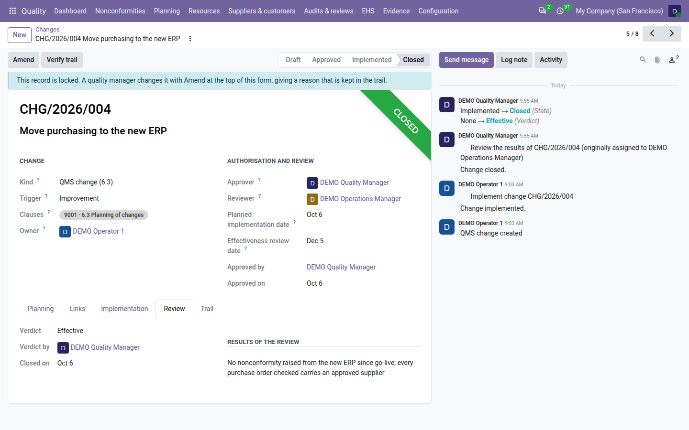
         verdict Effective, who gave it, the closing date and the results of the review.

The verdict can be recorded before the review date. Odoo refuses it, listing every problem at once, when:

.. list-table::
   :header-rows: 1
   :widths: 45 55

   * - Situation
     - Message
   * - You are the owner, or neither the reviewer nor a quality manager
     - *The reviewer (<name>) or a quality manager other than the owner closes the change.*
   * - The results are too short
     - *Write the results of the review (at least 20 characters) against: <criteria>.*
   * - No verdict chosen
     - *Choose whether the change achieved its purpose: effective, partially effective or not effective.*
   * - Actions arising are still draft or in progress
     - *Finish or cancel the open actions first: <action numbers>.*
   * - *Partially effective* without an action arising or a follow-up change
     - *A partly effective change needs a follow-up: Add action, or record a change that follows it up.*
   * - *Not effective* without a follow-up change or an action arising
     - *A change that did not work needs a follow-up change (to correct or reverse it) or an action.*

A follow-up change counts once it is approved: create the new change, set :guilabel:`Follows up` on its
:guilabel:`Links` tab, and approve it.

A later insight on the review is added by a quality manager with :guilabel:`Amend`, with a reason and a signature (see
:doc:`trail`). The verdict itself cannot be amended.

Cancel or delete a change
=========================

A change that will not happen — the budget was cut, the supplier withdrew — is cancelled, not deleted, so that the
auditor sees it was considered and stopped.

#. On a draft or approved change, click :guilabel:`Cancel`.
#. Write the :guilabel:`Reason` (at least 10 characters).
#. Click :guilabel:`Cancel change`.

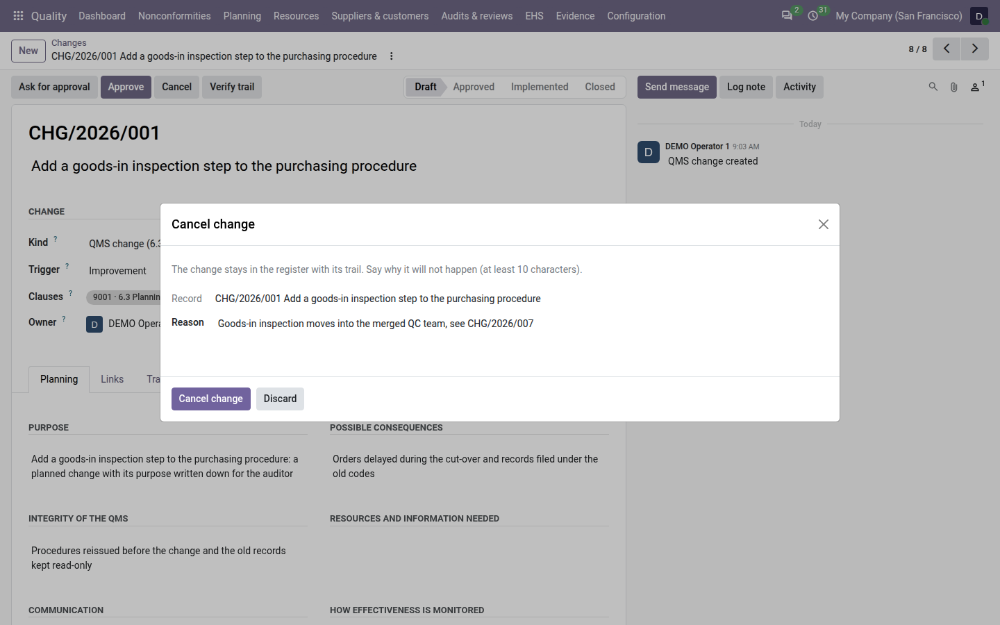

The change moves to **Cancelled** and is locked; its open to-dos are removed. Actions arising keep their own state.

A change that has been made cannot be cancelled: *This change has been made: review its results and close it; record
a follow-up change to reverse it.*

Only a draft can be deleted, by its creator or a quality manager. Any other change is refused with *Cancel the change
instead: a change that was approved stays as evidence.*, and a draft with actions with *Cancel the change instead:
actions arise from it.*

Reminders and the dashboard
===========================

Each step gives one to-do to the person whose turn it is:

.. list-table::
   :header-rows: 1
   :widths: 35 40 25

   * - When
     - To-do
     - Due
   * - :guilabel:`Ask for approval`
     - *Approve change <number>*, for the approver
     - in 7 days
   * - :guilabel:`Record urgent change`
     - *Approve change <number>*, for the approver or every quality manager
     - in 7 days
   * - :guilabel:`Approve`
     - *Implement change <number>*, for the owner
     - the planned implementation date
   * - :guilabel:`Mark implemented`, or the approval of an urgent change
     - *Review the results of <number>*, for the reviewer
     - the effectiveness review date

When the review date or the reviewer changes while the change is implemented, the open to-do moves with it.

The dashboard tile :guilabel:`Changes awaiting effectiveness review` counts the implemented changes waiting for
their verdict. Its badge shows the overdue reviews (*1 overdue*, red) and the urgent changes waiting for authorisation
(*1 to authorise*); click the tile or a badge to open the changes it counts. A quality user counts the changes they own
or review.

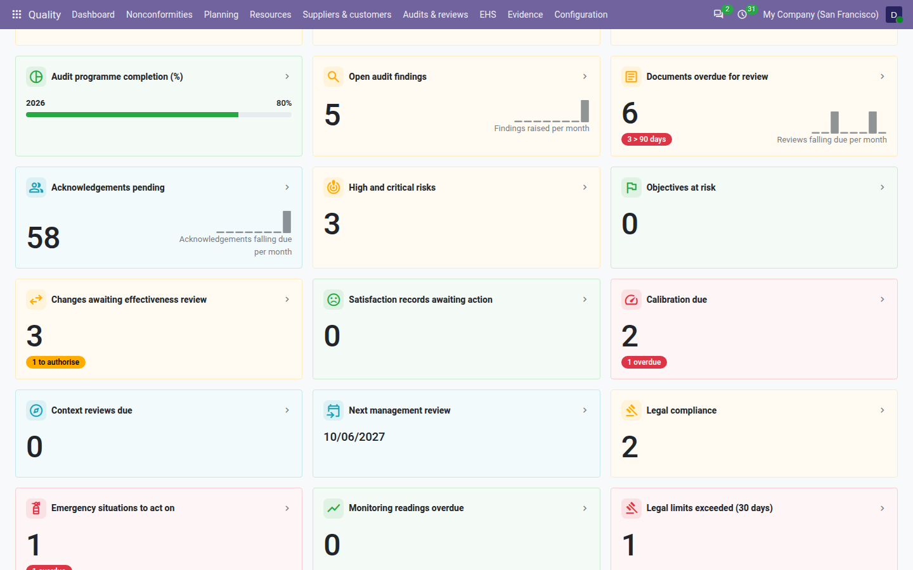

The change log
==============

The change log is the list the auditor reads: what changed in the period, who authorised it, what the review of the
results found and what followed.

#. Go to :menuselection:`Quality --> Planning --> Changes` and click :guilabel:`Print change log`.
#. Check :guilabel:`From` and :guilabel:`To`: the last twelve months by default.
#. Click :guilabel:`Print`.

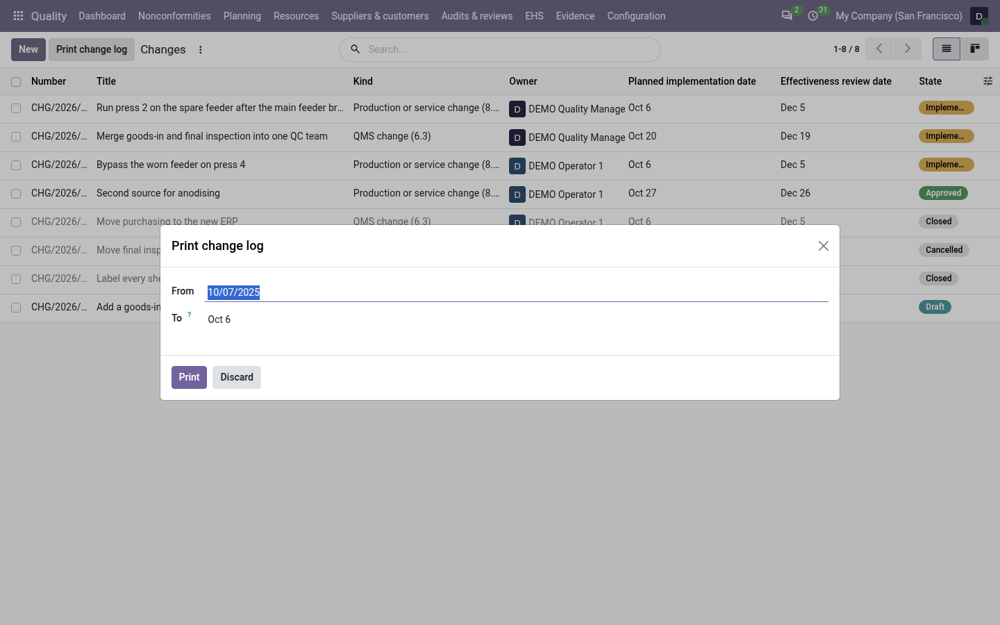

The PDF *QMS change log (ISO 9001 6.3, 8.5.6)* lists every change approved, implemented, closed or cancelled in the
period, the QMS changes first, then the production or service changes. Each shows its trigger and source, purpose,
consequences, integrity statement, owner, authorisation (or *Authorisation pending*), planned, implemented and
communicated dates, linked processes and documents, actions arising, reviewer, review of results, verdict and closing
date, or the cancellation reason. With no change in the period it states *0 records in period*.

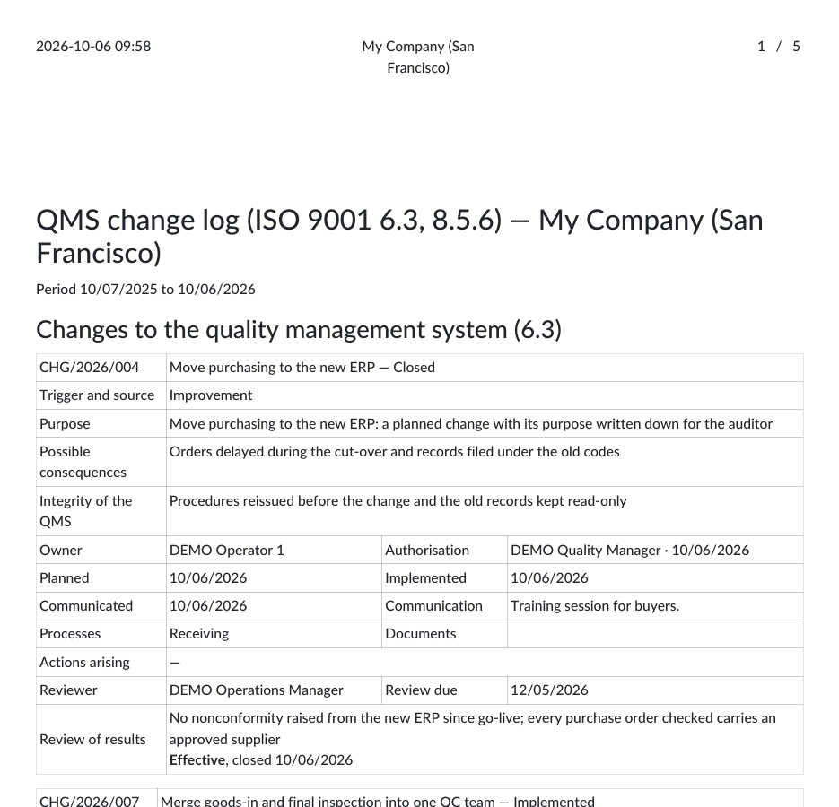
         CHG/2026/007.

The :doc:`audit pack <audit_pack>` includes the same log as ``24_qms_change_log.pdf``.

In the management review
------------------------

The ISO 9001 input *Opportunities for improvement* of a management review also shows the change figures of the
review period: changes approved and implemented by kind, urgent changes, changes closed by verdict, changes cancelled,
and the changes still waiting for their review at the end of the period, with the overdue ones. See
:doc:`management_reviews`.

.. _change-register-settings:

Setting
=======

:menuselection:`Quality --> Configuration --> Settings`, block :guilabel:`Changes`: :guilabel:`Effectiveness review`
is the number of days from the planned implementation date to the proposed effectiveness review date. The default is
60 days (90 with the *Lean* setup profile, 30 with *Regulated*). It must be at least 1 day. Changing it does not move
the review date of existing changes.

Changes are kept from the day they close or are cancelled, following the retention rule of the record type *change*
(see :doc:`documents`).

Who can do what
===============

.. list-table::
   :header-rows: 1
   :widths: 30 70

   * - Role
     - Change register
   * - **User**
     - Reads the changes of their companies. Creates changes, and plans, asks for approval, marks implemented, records
       as urgent and adds actions to the changes they own. Cancels the draft or approved changes they own or approve.
       Approves the changes that name them as approver and that they neither own nor created. Records the verdict of the changes that name them as reviewer and that
       they do not own. Deletes the drafts they created.
   * - **Internal auditor**
     - Reads every change; changes nothing.
   * - **Manager**
     - Everything, but never the verdict of a change they own. Only a quality manager changes the owner of a change.

See :doc:`roles` for the full picture.

.. seealso::
   - :doc:`corrective_actions`
   - :doc:`risks`
   - :doc:`management_reviews`
   - :doc:`audit_pack`
   - :doc:`edition_switch`
