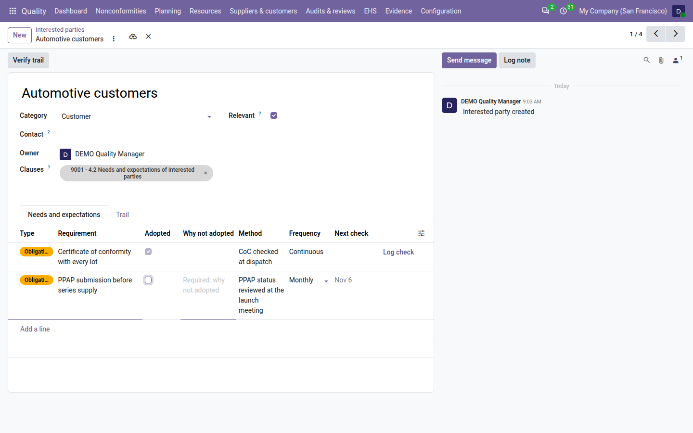
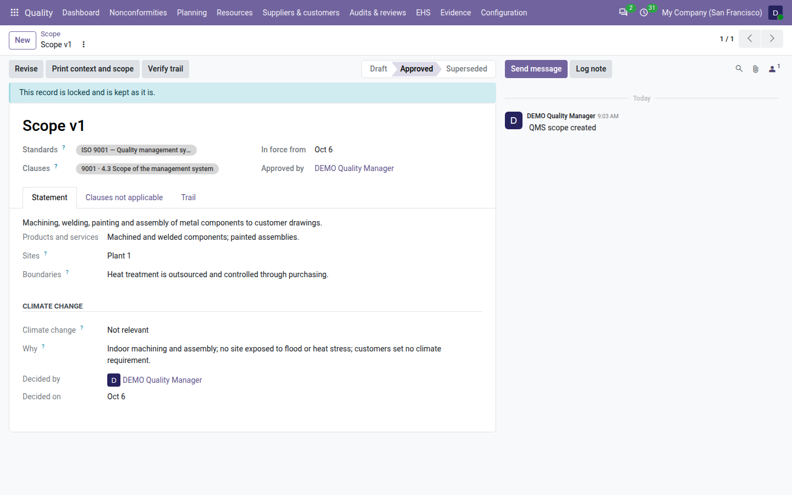

=================
Context and scope
=================

ISO 9001 clause 4 is where an external auditor starts: *what are the issues that affect your results, who are your
interested parties and what do they need, and what does your quality system cover?* With **QMS Advanced** installed,
the **Quality** app keeps the answers as three registers instead of a slide or a paragraph in the manual:

- **Issues** (clause 4.1) — the internal and external issues that affect the results of the quality system, each with
  an owner and a review date that keeps it current.
- **Interested parties** (clause 4.2) — customers, regulators, employees, the certification body… with their needs and
  expectations and how each one is monitored.
- **Scope** (clause 4.3) — the scope statement, approved with a signature, in force from its approval until it is
  revised, with the clauses the company declared not applicable.

Everything is under :menuselection:`Quality --> Planning --> Context`. Each register counts as evidence in the
:doc:`clause view <clauses>` for every period its records were in force.

Record the issues
=================

An issue is anything inside or outside the company that helps or hinders the results of the quality system: two
customers now require PPAP, a key machine is ageing, a new regulation is coming.

.. list-table::
   :header-rows: 1
   :widths: 15 85

   * - State
     - Meaning
   * - **Active**
     - The issue applies. It is reviewed at its interval.
   * - **Retired**
     - The issue no longer applies. It is locked, with the reason, and stays as evidence of the periods it applied.

#. Go to :menuselection:`Quality --> Planning --> Context --> Issues` and click :guilabel:`New`.
#. Write the :guilabel:`Issue` in one line, for example *Two customers now require PPAP*.
#. Choose the :guilabel:`Kind`: :guilabel:`External` (outside the company: market, law, technology…) or
   :guilabel:`Internal` (inside it: values and culture, knowledge, performance and resources).
#. Choose the :guilabel:`Category`. Once the kind is chosen, :guilabel:`Usual categories` lists the categories that
   usually go with it; every category remains allowed.
#. Choose the :guilabel:`Effect` on the results of the quality system: :guilabel:`Favourable`,
   :guilabel:`Unfavourable` (the default) or :guilabel:`Both`.
#. Check the :guilabel:`Owner` (you by default), and add the :guilabel:`Processes` the issue touches.
#. Check :guilabel:`Identified on` (today by default; it cannot be in the future) and :guilabel:`Review every (months)`
   (the :ref:`Issue review interval <config-context>` setting, 12 by default).
#. On the :guilabel:`Description` tab, describe the issue and, in :guilabel:`Monitoring`, how it is watched: sources,
   indicators, meetings.
#. Save.

Clause 4.1 of ISO 9001 is proposed in :guilabel:`Clauses`. :guilabel:`Next review` is the last review date — or, before
the first review, the identification date — plus the interval.

.. image:: ../_images/context-issue-form.png
   :alt: An active context issue: kind, category with the usual categories, effect, owner, processes, clause 4.1,
         identified on, review interval, last and next review dates, and the Mark reviewed and Retire buttons.

The list opens on the :guilabel:`Active` filter. Use :guilabel:`External` and :guilabel:`Internal`,
:guilabel:`Review overdue` and :guilabel:`My issues`, or group by :guilabel:`Kind`, :guilabel:`Category` or
:guilabel:`Owner`. An issue overdue for review is shown in red, with a red *Review overdue* ribbon on its form.

Review an issue
---------------

Before an issue's review date — 14 days before by default, the :ref:`Review reminder <config-context>` setting — its
owner gets a *Review the context issue <issue>* to-do, due on the review date. When the owner's user is archived, the
to-do goes to the :ref:`Fallback owner <config-fallback-owner>`. There is never more than one open at a time.

#. Open the issue and click :guilabel:`Mark reviewed`.
#. Write what the review found, at least ten characters, for example *Market unchanged, keep watching PPAP demand*.
#. Click :guilabel:`Mark reviewed`.

:guilabel:`Last reviewed on` becomes today, the note is kept on the :guilabel:`Last review` tab, the next review date
moves on by the interval, and the to-do is marked done. The review is on the issue's :guilabel:`Trail` tab.

Retire an issue
---------------

When an issue no longer applies, click :guilabel:`Retire`, give the reason (at least ten characters) and confirm. The
issue moves to **Retired** and is locked; its open review to-do is removed. A retired issue is never reviewed again.

Only the owner of the issue or a quality manager can mark it reviewed or retire it.

Record the interested parties
=============================

#. Go to :menuselection:`Quality --> Planning --> Context --> Interested parties` and click :guilabel:`New`.
#. Enter the party or group, for example *Automotive customers*, *Employees* or *the local community*. A name is used
   once per company, whatever the upper and lower case.
#. Choose the :guilabel:`Category`: :guilabel:`Customer`, :guilabel:`End user`, :guilabel:`Supplier`,
   :guilabel:`Employees`, :guilabel:`Owner or shareholder`, :guilabel:`Regulator`, :guilabel:`Certification body`,
   :guilabel:`Community`, :guilabel:`Partner` or :guilabel:`Other`.
#. When the party is one contact, for example a key customer, choose it in :guilabel:`Contact`. Leave it empty for a
   group.
#. Check the :guilabel:`Owner`. Clause 4.2 is proposed in :guilabel:`Clauses`.
#. Leave :guilabel:`Relevant` ticked when the party is relevant to the quality system. When you untick it, say why in
   :guilabel:`Why not relevant`.
#. On the :guilabel:`Needs and expectations` tab, add one line per need (see below).
#. Save.

Each need has:

- a :guilabel:`Type`: :guilabel:`Need`, :guilabel:`Expectation` or :guilabel:`Obligation` (a statutory, regulatory or
  contractual requirement, shown in amber);
- the :guilabel:`Requirement`, for example *Certificate of conformity with every lot*;
- :guilabel:`Adopted`: ticked when the company takes the need on as a requirement of its quality system. An adopted
  need must say how it is monitored: :guilabel:`Monitoring method` (for example *CoC checked at dispatch*) and
  :guilabel:`Monitoring frequency` (:guilabel:`Continuous`, :guilabel:`Monthly`, :guilabel:`Quarterly`,
  :guilabel:`Half-yearly` or :guilabel:`Yearly`).

:guilabel:`Next monitoring` is the last monitoring (or the day the need was added) plus the frequency. A
:guilabel:`Continuous` need is checked by an everyday control, such as every delivery, and is never overdue. When the
monitoring was done, click :guilabel:`Log check` on the need's line. The dialog says what it records and
shows the need's monitoring method and frequency, the last monitoring with its note, and the :guilabel:`Next
monitoring` date that recording today sets. Write what the check found (at least ten characters) and confirm:
Odoo confirms *Monitoring recorded on … Next check due on …*, and the need's line shows the new
:guilabel:`Last monitored on` and :guilabel:`Next monitoring`.

.. image:: ../_images/context-party-form.png
   :alt: An interested party with its category, contact, owner and relevance, and the Needs and expectations tab with
         the type, requirement, adopted flag, monitoring method and frequency, and the Record monitoring button.

.. _context-not-adopted:

Needs not adopted
-----------------

A company does not have to take on every need of every party, but it must be able to say why. When you untick
:guilabel:`Adopted` on a need, the :guilabel:`Why not adopted` column becomes required: write the reason, for example
*Not in the contract; reconsidered at the 2027 review*. Odoo refuses to save a need that is not adopted without a
reason: *Say why this need is not adopted: write the reason in Why not adopted, or tick Adopted and say how the need is
monitored.*

         adopted cell marked Required.

A need saved as not adopted before this rule existed keeps its place; the reason is asked the next time its adoption is
changed or the need is edited in the form. The context and scope PDF prints the needs not adopted with their reason,
and a change of the adoption or of the reason counts as a changed need in the management review. This works the same
under the 2015 and the 2026 edition of ISO 9001.

A party that is not relevant but still has adopted needs shows the warning *This party is not relevant but has
adopted needs.* In the list, use the :guilabel:`Relevant`, :guilabel:`Not relevant`, :guilabel:`Monitoring overdue`
and :guilabel:`Archived` filters. A party you no longer track is archived from the :guilabel:`Actions` menu.

Write and approve the scope
===========================

The scope says what the quality system covers, as the certificate states it. It is kept as numbered versions: one
version in force per company at a time.

.. list-table::
   :header-rows: 1
   :widths: 15 85

   * - State
     - Meaning
   * - **Draft**
     - Being written. It can still change, or be deleted.
   * - **Approved**
     - Signed by a quality manager and in force from the day of its approval. It is locked.
   * - **Superseded**
     - Replaced by a newer approved version. It keeps its dates: in force from … until the day before its successor.

#. Go to :menuselection:`Quality --> Planning --> Context --> Scope` and click :guilabel:`New`. The version gets its number, for
   example *Scope v1*.
#. On the :guilabel:`Statement` tab, write the scope statement in terms of the products and services covered, and,
   if useful, the :guilabel:`Products and services`, the :guilabel:`Sites` and the :guilabel:`Boundaries`
   (organisational and physical boundaries, outsourced processes).
#. Choose the :guilabel:`Standards` the scope claims: enabled standards only. Clause 4.3 is proposed in
   :guilabel:`Clauses`.
#. Open the :guilabel:`Clauses not applicable` tab. On a draft it previews the clauses declared not applicable today
   for the claimed standards, with their justification; declarations of standards the scope does not claim are listed
   apart, under *Not claimed by this scope*. See :ref:`clauses-not-applicable`.
#. Save.

To approve it, a quality manager clicks :guilabel:`Approve`, confirms *Approve and sign this scope? It is then locked
and in force from today.* and, when Odoo asks for the password, enters their own.
The approval is an electronic signature with the reason *Scope approval*. At that moment:

- the clauses not applicable shown in the preview are copied into the scope, with their justification and who declared
  them when. This copy is frozen with the signature: the auditor reads what the company stated on that day;
- the scope moves to **Approved**, in force from today (:guilabel:`In force from`), with :guilabel:`Approved by`;
- the version that was in force until then moves to **Superseded**, in force until yesterday.

Odoo refuses to approve a scope without a statement, without a standard, or claiming a disabled standard. A version
approved today stays in force today: its revision can be approved from tomorrow.

.. image:: ../_images/context-scope-form.png
   :alt: An approved scope version with its in-force dates and approver, the standards claimed, and the Clauses not
         applicable tab listing the frozen declarations with their justification.

.. _context-climate:

The climate change decision
---------------------------

Since 2024, an ISO 9001 company must decide whether climate change is a relevant issue for its quality system, and
the 2026 edition keeps it in clause 4.1. The decision is part of the scope, so it is signed and printed with it. It is
needed under the 2015 and the 2026 edition alike.

#. On the draft scope, in the :guilabel:`Climate change` section of the :guilabel:`Statement` tab, choose
   :guilabel:`Climate change`: *Relevant* or *Not relevant*.
#. In :guilabel:`Why`, write the reason, for example *Indoor machining and assembly; no site exposed to flood or heat
   stress; customers set no climate requirement.* When climate change is relevant, name the issues or risks that carry
   it.

:guilabel:`Decided by` and :guilabel:`Decided on` fill themselves with your name and today's date when you record the
decision or change it.

         DEMO Quality Manager and Decided on.

Odoo refuses to approve a scope without the decision:

- *Record the climate change decision before approving: say whether climate change is a relevant issue for the QMS
  (ISO 9001 4.1) and why, in the Climate change section, then approve.*
- *Write why climate change is not relevant for the QMS in the Climate change section, then approve.* (or *relevant*)

A scope approved before the decision existed stays in force, with an amber notice: *This scope was approved without a
climate change decision (ISO 9001 4.1). Press Revise to record it in a new version, then approve that version.* The
audit pack lists such a scope too (see :doc:`audit_pack`). A revision copies the decision of the scope it revises.
The context and scope PDF prints *Climate change: <decision> — <reason> — decided by <name> on <date>*.

Revise the scope
----------------

A scope in force is never edited. To change it, a quality manager clicks :guilabel:`Revise` on the approved version.
Odoo opens the company's draft revision, or creates one copied from the version in force (statement, products and
services, sites, boundaries, standards and clauses), which shows :guilabel:`Revises` with the version it replaces.
Change it, then approve it as above.

When clauses are declared not applicable, or applicable again, after the scope was approved, the approved scope shows
a warning: *Clause applicability changed since this scope was approved: <changes>. Revise the scope.* The changes read,
for example, *8.3 declared not applicable on 2026-09-28*. The scope in force keeps its frozen list until it is revised.

A draft can be deleted by a quality manager. An approved or superseded scope is never deleted.

Print the context and scope
===========================

#. Go to :menuselection:`Quality --> Planning --> Context --> Print context and scope`, or click :guilabel:`Print context and
   scope` on an approved scope.
#. Choose the :guilabel:`As at` date: today by default.
#. Click :guilabel:`Print`.

The PDF *Context and scope* lists the issues active on that date, the interested parties with their needs and
monitoring, and the scope in force on that date with its clauses not applicable. It ends with the standard footer of
every Quality report. The :doc:`audit pack <audit_pack>` includes it as ``10_context_and_scope.pdf``.

Evidence, review and dashboard
==============================

- **Evidence.** In the :doc:`clause view <clauses>`, an issue counts for clause 4.1 in every period from its
  identification until it is retired; an interested party counts for 4.2 while it is active; a scope version counts
  for 4.3 while it is in force. Drafts never count.
- **Management review.** Input *9.3.2 b — Changes in external and internal issues* shows, for the review period, the
  issues active, identified, changed and retired, the issues overdue for review, the needs added, changed and overdue
  for monitoring, whether the scope changed and the clause applicability changes. With nothing in the period it reads
  *No context register entries for the period*. See :doc:`management_reviews`.
- **Dashboard.** The :guilabel:`Context reviews due` tile counts the active issues overdue for review, the adopted needs
  overdue for monitoring and, per company, an approved scope whose clause applicability changed since approval. It is
  amber when something is due. With :guilabel:`My records`, it counts the issues and parties you own.

Who can do what
===============

.. list-table::
   :header-rows: 1
   :widths: 25 75

   * - Role
     - Context and scope
   * - **User**
     - Creates and edits the issues, interested parties and needs of their company, records monitoring, and marks
       reviewed or retires the issues they own. Reads the scope.
   * - **Internal auditor**
     - The same as a user, and reads everything.
   * - **Manager**
     - Everything: reviews and retires any issue, writes, approves (signed) and revises the scope, deletes a draft
       scope.

See :doc:`roles` for the full picture.

.. seealso::
   - :doc:`clauses`
   - :doc:`risks`
   - :doc:`management_reviews`
   - :doc:`audit_pack`
