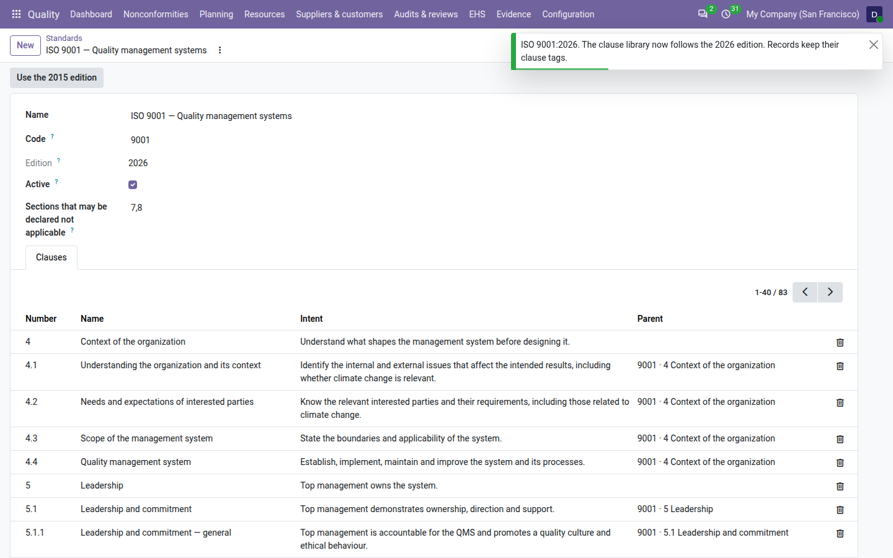
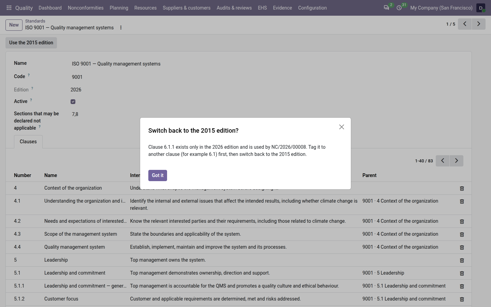

===============================
ISO 9001: 2015 or 2026 edition
===============================

ISO 9001:2026 was published in September 2026. A company that holds an ISO 9001:2015 certificate moves to the 2026
edition at one audit, chosen with its certification body, before the end of the transition period. Until then it keeps
working to 2015.

The **Quality** app keeps one ISO 9001 clause library and lets a quality manager choose which edition it follows. The
library supports the ISO 9001:2026 clause structure: switching changes the clause titles and short intents in place,
adds the new sub-clauses 6.1.1 to 6.1.3 and merges 10.3 into 10.1. Every record keeps its clause tags, because the
clause numbers do not change. The list of changes is on :doc:`what_changed_in_2026`.

.. list-table::
   :header-rows: 1
   :widths: 20 80

   * - Edition
     - When to use it
   * - **2015**
     - The default. Use it as long as your certificate, your next audit and your internal documents refer to ISO
       9001:2015.
   * - **2026**
     - Use it from the moment you prepare the transition audit: your internal audits, management reviews and audit
       pack then follow the 2026 structure.

.. note::
   The edition is one choice for the whole database: with several companies, all of them follow the same edition.

Switch to the 2026 edition
==========================

Only a quality manager can switch.

#. Go to :menuselection:`Quality --> Configuration --> Standards` and open *ISO 9001 — Quality management systems*.
   The :guilabel:`Edition` field reads ``2015``.

   .. image:: ../_images/edition-switch-standard.png
      :alt: The ISO 9001 standard form on edition 2015, with the Use the 2026 edition button and the Clauses tab.

#. Click :guilabel:`Use the 2026 edition`.
#. Odoo asks: *The ISO 9001 clause library will follow the 2026 edition: new titles, clauses 6.1.1 to 6.1.3, and 10.3
   merged into 10.1. Records keep their clause tags. Switch now?* Click :guilabel:`Ok`.

   .. image:: ../_images/edition-switch-confirm.png
      :alt: The confirmation dialog of the switch to the 2026 edition with the Ok and Discard buttons.

Odoo confirms *ISO 9001:2026. The clause library now follows the 2026 edition. Records keep their clause tags.* The
:guilabel:`Edition` field reads ``2026``, the button becomes :guilabel:`Use the 2015 edition`, and the
:guilabel:`Clauses` tab shows the 2026 titles and the new sub-clauses.

         titles and intents, such as 4.4 Quality management system.

The switch is recorded in the trail of the ISO 9001 standard, with your name and the time, as a change of the edition
from 2015 to 2026. The trail export of the period shows it (see :doc:`trail`).

What changes with the 2026 edition
----------------------------------

.. list-table::
   :header-rows: 1
   :widths: 30 70

   * - Where
     - What happens
   * - Clause library
     - The retitled clauses show their 2026 title and intent; 6.1.1, 6.1.2 and 6.1.3 appear under 6.1; 10.3 is
       removed when no record uses it, otherwise it is kept under 10.1 (see :doc:`what_changed_in_2026`).
   * - Records already tagged
     - Nothing is rewritten. A record tagged 6.1 or 10.2 keeps its tag. A closed record is never changed.
   * - Risks and opportunities
     - With **QMS Advanced**, every draft or open risk also gets 6.1.1 and 6.1.2, and every draft or open opportunity
       6.1.1 and 6.1.3. New risks and opportunities get them at creation. See :ref:`risks-2026-tags`.
   * - Internal audits
     - With **QMS Advanced**, an audit cannot start without its objectives. See :ref:`audits-objectives`.
   * - Management reviews
     - With **QMS Advanced**, a review created from now on gets the 2026 agenda: fourteen ISO 9001 inputs instead of
       twelve. A review created before the switch keeps its agenda. See :ref:`management-reviews-2026`.
   * - Audit pack
     - The integrity and completeness report lists the audits reported without objectives. See
       :ref:`audit-pack-2026`.

What does not depend on the edition: the climate change decision on the scope, the reason for a need not adopted,
the change register and pack file 24 work the same under 2015 and 2026.

.. tip::
   The clause view and the audit pack always show the titles of the edition in use, also for a period before the
   switch. Switch when you start preparing for the transition audit, not long before an audit of your 2015
   certificate.

Go back to the 2015 edition
===========================

If the switch was made too early, a quality manager can go back, as long as no record depends on a 2026-only clause.

#. Go to :menuselection:`Quality --> Configuration --> Standards` and open *ISO 9001 — Quality management systems*.
#. Click :guilabel:`Use the 2015 edition`.
#. Odoo asks: *The ISO 9001 clause library will go back to the 2015 edition and clauses 6.1.1 to 6.1.3 will be
   removed. Switch now?* Click :guilabel:`Ok`.

Odoo reloads the 2015 titles and intents, puts 10.1 and 10.3 back as they were, removes 6.1.1 to 6.1.3 and confirms
*ISO 9001:2015. The clause library now follows the 2015 edition. Records keep their clause tags.* The switch back is
recorded in the trail of the standard too.

With **QMS Advanced**, Odoo first removes 6.1.1, 6.1.2 and 6.1.3 from every draft or open risk and opportunity, and
adds 6.1 where it was not there. Management reviews keep the agenda they were created with.

When Odoo refuses to go back
----------------------------

The refusal is titled *Switch back to the 2015 edition?* and names the clause and the records that use it:

         edition and is used by NC/2026/00008.

.. list-table::
   :header-rows: 1
   :widths: 50 50

   * - Message
     - What to do
   * - *Clause 6.1.1 exists only in the 2026 edition and is used by NC/2026/00008. Tag it to another clause (for
       example 6.1) first, then switch back to the 2015 edition.* With several records: *… is used by 5 records:
       NC/2026/00012, NC/2026/00013, NC/2026/00014 and 2 more. Tag them to another clause …*
     - Open each record named, replace the 2026-only clause by another one (6.1 for example) and save. Then click
       :guilabel:`Use the 2015 edition` again.
   * - *Clause 6.1.2 is used by the closed record RSK/2026/002, which cannot change. The library stays on the 2026
       edition.* With several records: *… is used by 3 closed records (…), which cannot change.*
     - A closed or signed record is never rewritten, so the library stays on 2026 for good. There is nothing to do:
       2026 is the edition to keep.
   * - *ISO 9001 already follows the 2026 edition.* (or 2015)
     - The edition you asked for is already in use: nothing to do.
   * - *Only a quality manager can change the edition of a standard.*
     - Ask a quality manager. The buttons are shown to quality managers only.

.. note::
   Only ISO 9001 has a choice of edition. The other standards (ISO 14001, ISO 45001, ISO 13485 and ISO 22000) keep the
   edition shown in their :guilabel:`Edition` field.

.. important::
   The clause titles and intents of the shipped library are rewritten by the switch and by every update of the app.
   Your own wording on a shipped clause is lost; to keep your own wording, add your own clauses or your own standard
   (see :doc:`clauses`).

.. seealso::
   - :doc:`what_changed_in_2026`
   - :doc:`clauses`
   - :doc:`change_register`
