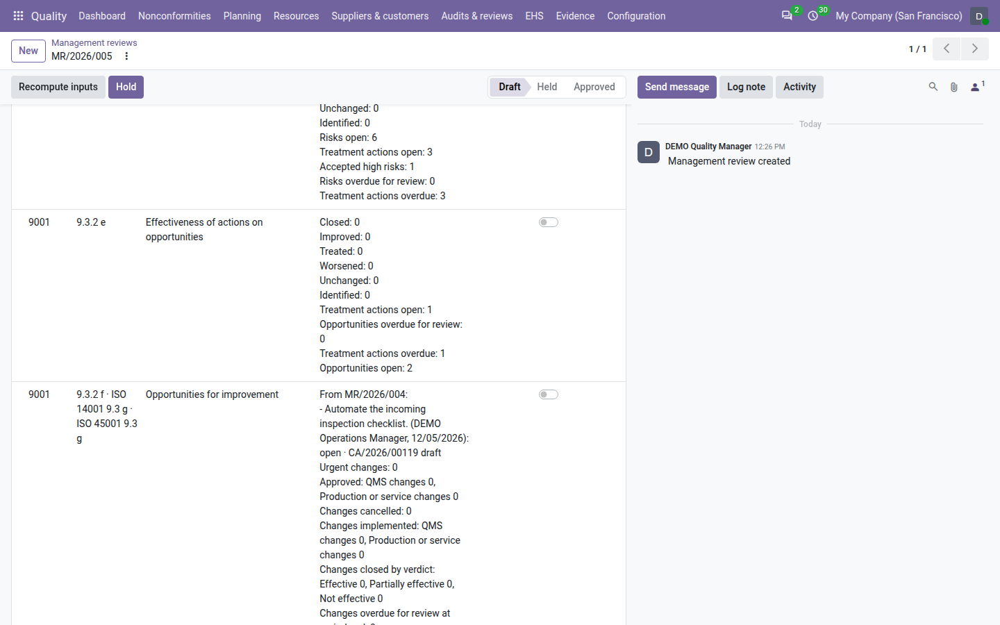

==================
Management reviews
==================

ISO 9001 clause 9.3 asks top management to review the quality management system at planned intervals, to consider a
fixed list of inputs, and to record its decisions. With **QMS Advanced** installed, the **Quality** app lays out the
agenda from the inputs of clause 9.3.2, fills it with the figures of the period from your nonconformities, corrective
actions, audits, context, objectives, satisfaction, calibration and risk registers, records the meeting and its
decisions, turns decisions into tracked actions, and has
the chair sign the minutes.

Every management review moves through three states:

.. list-table::
   :header-rows: 1
   :widths: 15 85

   * - State
     - Meaning
   * - **Draft**
     - Being prepared. The figures can be recomputed and the period changed.
   * - **Held**
     - The meeting took place: every input was discussed or noted. The figures are frozen; decisions and the
       conclusion are still being written.
   * - **Approved**
     - The chair signed the review. It is locked, and the minutes are final.

Prepare a review
================

#. Go to :menuselection:`Quality --> Audits & reviews --> Management reviews` and click :guilabel:`New`.
#. Choose the :guilabel:`Chair`: the member of top management who chairs and approves the review. It is you by
   default. The chair must be a **quality manager** of the review's company: only quality managers are offered, and
   Odoo refuses anyone else, because the chair holds and approves the review.
#. Add the :guilabel:`Attendees`.
#. Set the :guilabel:`Meeting date`: today by default.
#. Check the period the review covers: :guilabel:`Period start` and :guilabel:`Period end`. The start is proposed as
   the day after the period of the last approved review, so that consecutive reviews leave no gap and do not overlap;
   the end is today. If that period already reaches today, Odoo proposes the next period of the same length instead,
   starting the day after. For the first review, fill in the start yourself.
#. Save.

The review gets its number, such as ``MR/2026/003``, numbered in the year of its meeting, and starts in the **Draft**
state. Odoo lays out the ISO 9001 inputs on the :guilabel:`Inputs` tab — twelve, or fourteen when the review follows
the 2026 edition (see `The 2026 agenda`_) — and computes their figures at once; :guilabel:`Figures computed on` shows
when. :guilabel:`ISO 9001 agenda` shows the edition the review follows.

:guilabel:`Previous review` shows the latest approved review of the company whose period ended before this one starts.
Its decisions are carried forward into the first input. The first review of a company has no previous review.

Two warnings help you check the period:

- *The period exceeds 24 months: figures may take longer to compute.*
- *This period overlaps the approved review <number>, so some figures are counted in both reviews.*

Neither stops you; change the period if it was typed by mistake.

.. image:: ../_images/management-reviews-form.png
   :alt: A draft management review: number, chair, attendees, meeting date, period, previous review and the time the
         figures were computed, with the Inputs tab open.

.. note::
   Only quality managers create, chair and edit management reviews. Attendees who are quality users can read the
   reviews they attend.

The inputs
==========

The :guilabel:`Inputs` tab has one row per input of ISO 9001 clause 9.3.2, in the order of the standard. Each row
shows the :guilabel:`Clause`, the input, its :guilabel:`Figures`, your :guilabel:`Notes` and a :guilabel:`Discussed`
switch. The figures come from the registers of the app, for the review period:

.. list-table::
   :header-rows: 1
   :widths: 10 30 60

   * - Clause
     - Input
     - Figures computed for the period
   * - 9.3.2 a
     - Status of actions from previous reviews
     - The previous review's decisions: description, owner, due date, status and, when one was created, the action
       and its state. The status is read at the time of computing, so a decision marked done since then shows as done.
       *no previous review* for the first review.
   * - 9.3.2 b
     - Changes in external and internal issues
     - From the :doc:`context registers <context>`: issues active, identified, changed and retired, issues overdue for
       review, needs added, changed and overdue for monitoring, whether the scope changed, and the clause applicability
       changes.
   * - 9.3.2 c1
     - Customer satisfaction and feedback
     - From :doc:`customer satisfaction <satisfaction>`: the satisfaction records of the period, their average, each
       record, those below target or awaiting an action, the improvement actions raised; then the complaints detected
       in the period by severity and the complaint trend against the previous period.
   * - 9.3.2 c2
     - Extent to which quality objectives were met
     - From the :doc:`quality objectives <objectives>`: the objectives of the period by status, then one line per
       objective with its target and actual.
   * - 9.3.2 c3
     - Process performance and conformity
     - Nonconformities detected in the period by source and by severity, and their age in days at the end of the
       period (*<30*, *30-90*, *>90*).
   * - 9.3.2 c4
     - Nonconformities and corrective actions
     - Nonconformities closed in the period and how many of them had a verified corrective action; the effectiveness
       ratio; the corrective and preventive actions due in the period by state, by kind and by origin; the actions
       still in progress past their due date at the end of the period; the recurrences detected in the period. See
       :doc:`corrective_actions`.
   * - 9.3.2 c5
     - Monitoring and measurement results
     - From the :doc:`calibration register <calibration>`: equipment in service and its status at the end of the period,
       the calibrations of the period and their results, instruments overdue at the end of the period, out-of-tolerance
       events without impact assessment.
   * - 9.3.2 c6
     - Audit results
     - Audits started (or, if not started, planned) in the period and their states; their findings by grade; the
       nonconformities raised from those findings; the completion of the audit programme of the year the period ends
       in. See :doc:`audits`.
   * - 9.3.2 c7
     - Performance of external providers
     - With the :doc:`supplier evaluation <suppliers>` add-on: the supplier evaluations confirmed, by grade, their
       average and lowest scores, the suppliers' status at the end of the period, the decisions signed, the SCARs opened,
       closed and overdue, and the orders confirmed despite the supplier's status. In every case: the nonconformities
       from suppliers detected in the period, by severity.
   * - 9.3.2 d
     - Adequacy of resources
     - None: record them in the notes.
   * - 9.3.2 e
     - Effectiveness of actions on risks and opportunities
     - From the :doc:`risk register <risks>`: risks and opportunities open by level, identified, closed and treated in
       the period, how many were reduced, unchanged or increased, the high risks accepted, the treatment actions open
       and overdue, and the risks overdue for review.
   * - 9.3.2 f
     - Opportunities for improvement
     - The previous review's decisions of kind *Improvement* that are still open; with QMS Advanced, the figures of
       the :doc:`change register <change_register>`: changes approved and implemented by kind, urgent changes,
       changes closed by verdict, changes cancelled, and changes awaiting their effectiveness review at the end of the
       period, with the overdue ones.

Figures are shown in your language, counts as numbers and ratios as percentages. They are counted for the review's
company only, with the access rights of the person who computes them: a quality manager counts every record of the
company.

When a register has nothing for the period, the input says so in a sentence instead of a row of zeros: *No context
register entries for the period*, *No quality objectives for the period*, *No calibration recorded for the period*,
*No risk register entries for the period*, *No satisfaction record for the period*, or *Nothing recorded for the
period*. When an input's figures come from a part of the app that is not installed, it reads *component not installed —
record the discussion in the notes*.

Inputs cannot be added or deleted from the review. When an input does not apply, switch :guilabel:`Discussed` on and
write *not applicable* in its notes.

The agenda
----------

The agenda is made of the inputs of the enabled standards, listed under :menuselection:`Quality --> Configuration -->
Review inputs` with their :guilabel:`Clause`, :guilabel:`Input`, order and :guilabel:`Text when empty`. A quality
manager can rename an input, change its order or its text when empty, or archive it. When the agenda holds inputs of
more than one standard, the :guilabel:`Inputs` tab groups them by standard. Inputs of a standard enabled after the
review was created are added when you recompute a draft review.

.. _management-reviews-2026:

The 2026 agenda
---------------

A review follows the edition of ISO 9001 in use on the day it is created (see :doc:`edition_switch`), shown in
:guilabel:`ISO 9001 agenda`. Under the **2026** edition the ISO 9001 agenda has fourteen inputs instead of twelve:

.. list-table::
   :header-rows: 1
   :widths: 10 40 50

   * - Clause
     - Input
     - Figures
   * - 9.3.2 b
     - Changes in needs and expectations of interested parties
     - **New.** From the :doc:`context registers <context>`: needs added, needs changed and needs overdue for
       monitoring. With nothing in the period: *No interested-party needs for the period*.
   * - 9.3.2 e
     - Effectiveness of actions on risks
     - **Replaces** the combined risk input, for the risks only: risks open by level, identified, closed and treated,
       reduced, unchanged or increased, high risks accepted, treatment actions, risks overdue for review. Empty:
       *No risks in the register for the period*.
   * - 9.3.2 e
     - Effectiveness of actions on opportunities
     - **Replaces** the combined risk input, for the opportunities only: opportunities open, identified, closed and
       treated, how many improved, unchanged or worsened, the treatment actions and the opportunities overdue for
       review. Empty: *No opportunities in the
       register for the period*.

         input with its figures, and the Opportunities for improvement input with the change figures.

A review keeps the agenda it was created with. A draft prepared under 2015 keeps its twelve inputs when the company
switches to 2026, also after :guilabel:`Recompute inputs`; to discuss the 2026 inputs, delete the draft and create a
new review, or add the missing points in the notes. Held and approved reviews never change. The minutes print
*ISO 9001 agenda: 2026 edition* (or 2015), and the audit pack judges each review against its own agenda.

ISO 14001 and ISO 45001 inputs
------------------------------

With ISO 14001 or ISO 45001 enabled, the agenda also holds the twelve inputs of clause 9.3 of that standard, filled
from the environment, health and safety registers while they are switched on (see :doc:`ehs_setup`):

.. list-table::
   :header-rows: 1
   :widths: 14 43 43

   * - Clause
     - ISO 14001 input
     - ISO 45001 input
   * - 9.3 b 1–2
     - *Changes in external and internal issues and in compliance obligations*
     - *Changes in external and internal issues and in legal and other requirements*
   * - 9.3 b 3
     - *Changes in significant environmental aspects* — significant aspects at the end of the period, those that became
       or ceased significant, the controls missing (:doc:`environmental_aspects`)
     - *OH&S risks and opportunities* (9.3 b 3, d 6) — hazards by level, controls re-assessed and how many reduced the
       level (:doc:`hazards`)
   * - 9.3 c
     - *Extent to which environmental objectives were achieved*
     - *Extent to which OH&S objectives were met*
   * - 9.3 d 1
     - *Nonconformities and corrective actions*
     - *Incidents, nonconformities and corrective actions* — incidents by type, days lost, authority reports made late
       (:doc:`incidents`)
   * - 9.3 d 2
     - *Monitoring and measurement results* — each indicator of the standard with its period value and change, the
       exceedances, the overdue readings and the drills (:doc:`monitoring`, :doc:`emergency_preparedness`)
     - the same, for the health and safety indicators
   * - 9.3 d 3
     - *Fulfilment of compliance obligations* — the evaluations of the period by result (:doc:`legal_requirements`)
     - *Fulfilment of legal and other requirements* — the same
   * - 9.3 d 5
     - —
     - *Consultation and participation of workers* — consultations by kind and topic, reports by outcome, median days
       to close (:doc:`worker_consultation`)

Each standard also has its own input on communications with interested parties (9.3 f). The status of previous
actions, the audit results, the adequacy of resources, the opportunities for improvement and, for ISO 14001, the risks
and opportunities are shared with ISO 9001 (see below).

One integrated review
---------------------

A company working to ISO 9001, 14001 and 45001 holds one review for the three. The inputs the standards share and
whose figures are the same — the status of actions from previous reviews, the audit results, the adequacy of
resources, the opportunities for improvement, and the risks and opportunities of ISO 9001 and 14001 — appear **once**,
under the first standard, and name the clauses of the others, for example *9.3.2 a · ISO 14001 9.3 a · ISO 45001 9.3
a*. The inputs whose figures differ by standard (context, objectives, monitoring, compliance) stay separate. With the
three standards enabled, a new review has 27 inputs: the 12 of ISO 9001, then 7 of ISO 14001 and 8 of ISO 45001.

Recompute the figures
---------------------

While the review is **Draft**, click :guilabel:`Recompute inputs` to compute the figures again, for example after
changing the period or on the day of the meeting. :guilabel:`Figures computed on` is updated. Once the review is held,
the figures are frozen: the figures discussed are the figures signed.

Hold the meeting
================

During the meeting, go through the inputs: write the discussion in :guilabel:`Notes` and switch
:guilabel:`Discussed` on for each input covered. Then click :guilabel:`Hold`.

Odoo checks that the :guilabel:`Meeting date` is set and that every input is either discussed or has notes; if not,
it lists the inputs still open. The review moves to **Held**. The chair is added to the attendees if they were not
listed.

A quality manager holds the review: the chair, or another quality manager on the chair's behalf, in which case the
trail says so. The :guilabel:`Recompute inputs` and :guilabel:`Hold` buttons are shown to quality managers only.

After the meeting is held, you can still change the attendees and the meeting date, complete the notes, and record
the decisions and the conclusion until the review is approved. The chair and the period can be changed only while the
review is a draft.

.. image:: ../_images/management-reviews-inputs.png
   :alt: The Inputs tab of a held review: each ISO 9.3.2 input with its clause, computed figures, notes and the
         Discussed switch on.

Record decisions
================

Decisions are the outputs of the review (ISO 9001 clause 9.3.3). On the :guilabel:`Decisions` tab, add one line per
decision, while the review is draft or held:

- :guilabel:`Kind`: :guilabel:`Improvement`, :guilabel:`Resource`, :guilabel:`Change to the QMS`,
  :guilabel:`Action` or :guilabel:`Other`;
- :guilabel:`Description`: what was decided;
- :guilabel:`Owner` and :guilabel:`Due on`: who carries it out, and by when. Both are required;
- :guilabel:`Status`: :guilabel:`Open` (the default), :guilabel:`Done` or :guilabel:`Dropped`.

Once the review is approved, decisions can no longer be added, deleted or rewritten, but their :guilabel:`Status`
stays editable: mark a decision :guilabel:`Done` or :guilabel:`Dropped` from the approved review when it is carried
out or abandoned. Each change is recorded.

Decisions of kind *Improvement* that are still open appear in the next review under *Opportunities for improvement*,
and every decision appears there under *Status of actions from previous reviews* with its status.

Turn a decision into an action
------------------------------

A decision that needs work can become a tracked action, so that it lands on the owner's list with a due date and a
state.

#. Make sure the review is **Held** or **Approved** and the decision has an owner and a due date.
#. Click :guilabel:`Create action` on the decision's line.

Odoo creates a **preventive** action: its title is the start of the decision's description, with the full
description, the decision's owner and due date, the review's clauses, and an effectiveness date equal to the due date
plus the :guilabel:`Effectiveness gap` of the corrective action settings. The action's number shows in the decision's
:guilabel:`Action` column, and the button disappears: a decision gets one action only.

The action is then followed like any other in :menuselection:`Quality --> Nonconformities --> Corrective actions`: started, done and
verified for effectiveness. See :doc:`corrective_actions`. The :guilabel:`Actions` tab of the review lists all the
actions created from its decisions, with their number, title, owner, due date and state.

Only quality managers see the :guilabel:`Create action` button, and only once the meeting is held.

.. image:: ../_images/management-reviews-decisions.png
   :alt: The Decisions tab of a held review: decisions with their kind, description, owner, due date and status, one
         of them with its created action and the others with the Create action button.

Approve the review with a signature
===================================

The chair signs the minutes. From then on, the review is locked.

#. On the :guilabel:`Conclusion` tab, write the conclusion: is the quality management system suitable, adequate and
   effective?
#. Check that every input has :guilabel:`Discussed` switched on — notes alone are enough to hold the meeting, not to
   approve it — and that every decision has an owner and a due date.
#. As the chair, click :guilabel:`Approve`.
#. Click :guilabel:`Sign and approve` and, when Odoo asks for your password, enter your own.

The review moves to **Approved**. The signature is recorded with the reason *Management review approval*, and the
:guilabel:`Minutes hash` on the :guilabel:`Conclusion` tab fingerprints the review's trail at the moment of approval.
The inputs, decisions, conclusion, attendees and meeting date can no longer be changed.

Only the chair approves, and the :guilabel:`Approve` button is shown to the chair only. A quality manager who is not
the chair cannot approve, even on the chair's behalf. Odoo refuses to approve and says why when the conclusion is
empty, an input is not discussed, or a decision lacks an owner or a due date.

.. image:: ../_images/management-reviews-approve-dialog.png
   :alt: The Approve review dialog explaining that approval signs and locks the review, with the Sign and approve
         button.

.. note::
   Whether Odoo asks for the password is a setting: :ref:`Ask the password before signing <config-password>` in the
   :guilabel:`Integrity` block of the Quality settings. It is on by default. See :doc:`configuration`.

Amend an approved review
------------------------

When the conclusion of an approved review must be corrected, a quality manager amends it:

#. Click :guilabel:`Amend`.
#. Correct the :guilabel:`Conclusion`.
#. Give the :guilabel:`Reason` for the change, at least ten characters.
#. Click :guilabel:`Amend and sign`. If Odoo asks for your password, enter your own: the amendment is applied once it
   is confirmed.

The amendment is signed (reason *Amendment*) and the trail keeps the original conclusion next to the new one, with your
reason. Only the conclusion is amended from this dialog. The next print of the minutes shows the amended conclusion
and is stored in its turn; the minutes printed before the amendment stay attached to the review.

Print the minutes
=================

Click :guilabel:`Print minutes` on a held or approved review. A draft review has no minutes: hold the meeting first.
Printing the minutes of a draft review from the :guilabel:`Print` menu is refused the same way.

The minutes show:

- the review number, the period, the meeting date, the chair and the attendees;
- each input with its clause, its figures and its notes;
- the decisions with their kind, description, owner, due date, status and the number of the action created from them;
- the conclusion;
- once approved, the signature block: *Approved by <chair>, <date and time> UTC* and the minutes hash;
- the standard footer of every Quality report: the generation date and a fingerprint of the document.

While the review is **Held**, the minutes carry a large *DRAFT — not approved* watermark and no signature. Once the
review is **Approved**, the first print is stored on the review, and later prints return that same stored file, so the
minutes everyone receives are the minutes that were signed. An amendment of the conclusion starts a new stored
print.

.. image:: ../_images/management-reviews-minutes.png
   :alt: The printed minutes of an approved management review: header, inputs with figures and notes, decisions,
         conclusion and the signature block with the minutes hash.

.. tip::
   The :doc:`audit pack <audit_pack>` includes the minutes of the approved management reviews whose meeting falls
   in its period.

Plan the next review
====================

Reviews must happen at planned intervals. Odoo computes when the next one is due: the meeting date of the last
approved review plus the :ref:`Review interval <reviews-settings>` (12 months by default).

The :doc:`dashboard` shows it on the :guilabel:`Next management review` tile, as a date:

- red when the date has passed;
- amber when it falls within the :ref:`Review reminder <reviews-settings>` window (30 days by default);
- blue otherwise.

The tile opens the management reviews. It is hidden while the company has no approved review, and when the interval
is 0.

Every day, when the next review is due within the reminder window, or already overdue, and no review of the company
is draft or held, each quality manager of the company gets a *Management review due* to-do, *Next management review
due <date>*, on the last approved review, due on that date. A quality manager never gets a second one while theirs is
open. Creating the next review as a draft stops the reminders.

.. image:: ../_images/management-reviews-tile.png
   :alt: The Next management review tile on the Quality dashboard with the date the next review is due.

Find reviews
============

:menuselection:`Quality --> Audits & reviews --> Management reviews` lists the reviews, newest meeting first, with their number, meeting
date, period, chair and state: held reviews in amber, approved ones in green. Useful filters:

- :guilabel:`My reviews`: the reviews you chair or attend;
- :guilabel:`Draft` and :guilabel:`Approved`.

You can group by :guilabel:`State` or :guilabel:`Meeting year`. Every review also keeps a :guilabel:`Trail` tab with
each change of state, chair, attendees, meeting date and period. See :doc:`trail`.

.. _reviews-settings:

Settings
========

Go to :menuselection:`Settings --> Quality`, block :guilabel:`Management review`. Only quality managers see the
Quality settings.

.. list-table::
   :header-rows: 1
   :widths: 22 43 12 23

   * - Setting
     - What it does
     - Default
     - Example
   * - :guilabel:`Review interval`
     - Months between two management reviews. The next review is due this many months after the meeting of the last
       approved review. 0 hides the dashboard tile and stops the reminders.
     - 12
     - 6 for a review every half year.
   * - :guilabel:`Review reminder`
     - Days before the due date when the quality managers get their to-do, and the tile turns amber.
     - 30
     - 45 to leave time to book top management.

Two other Quality settings apply (see :doc:`configuration` and :doc:`corrective_actions`):

- :guilabel:`Ask the password before signing` (on by default): the password is asked when the chair approves.
- :guilabel:`Effectiveness gap`: sets the effectiveness date of the actions created from decisions.

Who can do what
===============

.. list-table::
   :header-rows: 1
   :widths: 25 75

   * - Role
     - Management reviews
   * - **User**
     - Reads the reviews they attend, with their inputs, decisions and actions. Works on the actions they own like any
       other action. Cannot chair a review.
   * - **Internal auditor**
     - Reads every management review of the company.
   * - **Manager**
     - Everything: creates reviews, chairs them, recomputes the inputs, writes notes, decisions and the conclusion,
       holds the review on the chair's behalf, creates actions from decisions, updates decision statuses after
       approval and amends the conclusion of an approved review. Only the chair approves.

See :doc:`roles` for the full picture.

.. seealso::
   - :doc:`corrective_actions`
   - :doc:`audits`
   - :doc:`documents`
   - :doc:`audit_pack`
   - :doc:`trail`
   - :doc:`dashboard`
