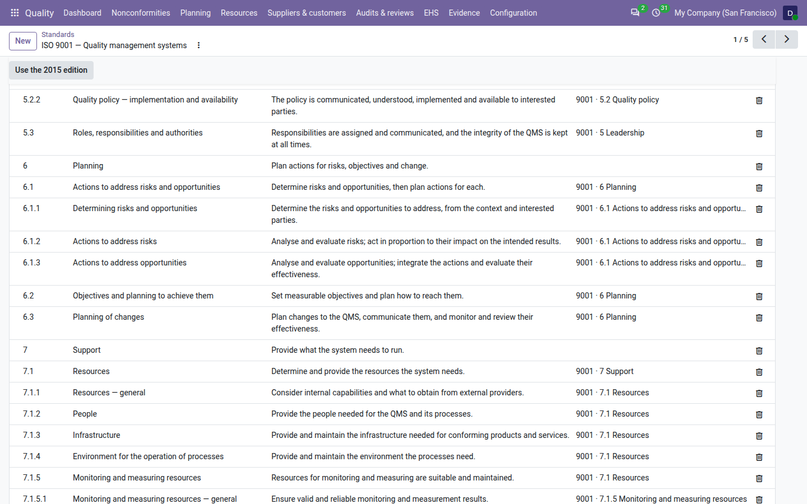

=====================
What changed in 2026
=====================

This page lists, clause by clause, what the ISO 9001 clause library of the **Quality** app changes when it follows the
2026 edition, and which screens of the app help with each change. The library supports the ISO 9001:2026 clause
structure; it does not contain the text of the standard. Titles are short and intents are one sentence, written for
the app and not taken from the standard, as for the 2015 edition. Read the standard itself for the requirements.

To switch the library to the 2026 edition, or back, see :doc:`edition_switch`.

         new sub-clauses 6.1.1, 6.1.2 and 6.1.3 under 6.1, and the new intent of 6.3.

The clause numbers stay the same
================================

Clauses 4 to 10 keep their numbers in the 2026 edition, with two exceptions that the library handles for you:

- **6.1** gets three sub-clauses: 6.1.1, 6.1.2 and 6.1.3. They are added to the library; 6.1 stays and counts the
  records of its sub-clauses in the clause view.
- **10.3** no longer exists: continual improvement moves into **10.1**. When no record uses 10.3, the library removes
  it. When records use it, 10.3 stays, under 10.1, titled *Continual improvement (2015 numbering, now in 10.1)*, so
  those records count for 10.1 and no closed record is changed.

Every other clause keeps its row, its tags and its translations. With 2026, the ISO 9001 library has 83 clauses
instead of 81.

New sub-clauses
===============

.. list-table::
   :header-rows: 1
   :widths: 12 33 55

   * - Clause
     - Title in the library
     - Intent in the library
   * - 6.1.1
     - Determining risks and opportunities
     - Determine the risks and opportunities to address, from the context and interested parties.
   * - 6.1.2
     - Actions to address risks
     - Analyse and evaluate risks; act in proportion to their impact on the intended results.
   * - 6.1.3
     - Actions to address opportunities
     - Analyse and evaluate opportunities; integrate the actions and evaluate their effectiveness.

Retitled clauses
================

.. list-table::
   :header-rows: 1
   :widths: 12 44 44

   * - Clause
     - 2015 title in the library
     - 2026 title in the library
   * - 4.4
     - The management system and its processes
     - Quality management system
   * - 5.2
     - Policy
     - Quality policy
   * - 5.2.1
     - Establishing the quality policy
     - Quality policy — content
   * - 5.2.2
     - Communicating the quality policy
     - Quality policy — implementation and availability
   * - 7.1.5.2
     - Measurement traceability
     - Traceability of measurement results
   * - 7.5.2
     - Creating and updating
     - Creating and updating documented information
   * - 8.2.2
     - Determining the requirements for products and services
     - Determining requirements for products and services
   * - 8.2.3
     - Review of the requirements for products and services
     - Review of requirements for products and services
   * - 9.3.3
     - Management review outputs
     - Management review results
   * - 10.1
     - Improvement — general
     - Continual improvement
   * - 10.3
     - Continual improvement
     - Removed, or kept under 10.1 when records use it (see above)

The 2026 edition no longer titles 5.2.1 and 5.2.2. The library keeps a short title for both, so that they can be read
in pickers and lists.

Clause by clause
================

What the 2026 intent of each changed clause adds, and where the app helps. A clause not listed keeps its 2015 title
and intent.

.. list-table::
   :header-rows: 1
   :widths: 10 45 45

   * - Clause
     - What the 2026 intent adds
     - Where the app helps
   * - 4.1
     - Whether climate change is a relevant issue.
     - The climate change decision on the scope (QMS Advanced). See :ref:`context-climate`.
   * - 4.2
     - Requirements of interested parties related to climate change; which requirements the QMS addresses.
     - :guilabel:`Why not adopted` on every need that is not adopted (QMS Advanced). See :ref:`context-not-adopted`.
   * - 4.4
     - New title only.
     - —
   * - 5.1.1
     - Top management promotes a quality culture and ethical behaviour.
     - The document type *Code of conduct and quality culture* (QMS Advanced). See
       :ref:`Code of conduct and quality culture <documents-code-of-conduct>`.
   * - 5.2, 5.2.1, 5.2.2
     - The policy is implemented and available to interested parties.
     - The quality policy document of QMS Advanced (see :doc:`documents`).
   * - 5.3
     - The integrity of the QMS is kept at all times.
     - The :guilabel:`Integrity of the QMS` statement of each change (see :doc:`change_register`).
   * - 6.1
     - Risks and opportunities are determined, then actions are planned for each.
     - Becomes the parent of 6.1.1 to 6.1.3.
   * - 6.1.1 – 6.1.3
     - New sub-clauses (see above).
     - Risks are tagged 6.1.1 and 6.1.2, opportunities 6.1.1 and 6.1.3, and the management review shows separate
       figures for each (QMS Advanced). See :ref:`risks-2026-tags`.
   * - 6.3
     - Changes are communicated, and their effectiveness is monitored and reviewed.
     - The change register (QMS Advanced): see :doc:`change_register`.
   * - 7.1.5.2
     - New title only.
     - The calibration register (see :doc:`calibration`).
   * - 7.1.6
     - Knowledge is retained, applied and shared for the intended results.
     - —
   * - 7.3
     - People are aware of the quality culture and the expected ethical behaviour.
     - Acknowledgements of the code of conduct (QMS Advanced). See
       :ref:`Code of conduct and quality culture <documents-code-of-conduct>`.
   * - 7.5.2
     - New title only.
     - Document control (see :doc:`documents`).
   * - 8.2.1
     - Customers are told about contingency actions, including disruptions.
     - —
   * - 8.2.2, 8.2.3
     - New titles; requirements are reviewed when they are new **or changed**.
     - —
   * - 8.3.2, 8.4.3
     - Other relevant interested parties, not only customers.
     - —
   * - 8.5.6
     - No change of title or intent.
     - The change register records production and service changes too (see :doc:`change_register`).
   * - 9.1.2
     - Customer satisfaction itself is monitored.
     - Customer satisfaction records (see :doc:`satisfaction`).
   * - 9.2.2
     - The objectives, criteria and scope of each audit are defined.
     - :guilabel:`Objectives` on every audit, required to start an audit under 2026 (QMS Advanced). See
       :ref:`audits-objectives`.
   * - 9.3.2
     - The inputs include changes in interested parties' needs, and risks and opportunities separately.
     - The 2026 agenda of the management review (QMS Advanced). See :ref:`management-reviews-2026`.
   * - 9.3.3
     - New title only.
     - —
   * - 10.1
     - Continual improvement: the results of monitoring, analysis and management review are used to find
       opportunities to improve.
     - Takes over from 10.3.

.. note::
   *Known limits.* The library reflects the published table of contents of ISO 9001:2026 and short intents written
   from public summaries. It is a way to tag and find evidence; it is not a substitute for the standard, and tagging
   records to a clause does not prove that its requirement is met. Records tagged to a clause show where to look; the
   requirement is judged against the text of the standard.

.. seealso::
   - :doc:`edition_switch`
   - :doc:`clauses`
   - :doc:`change_register`
